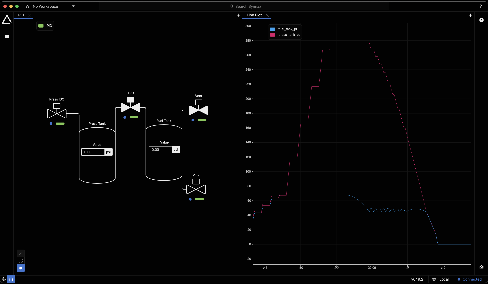

# Synnax - Tank Pressure Control Example

This example demonstrates how to use Synnax to control the pressure of a simulated tank.

## Running the Example

There are three scripts in this example:

1. `simulated_daq.py` - This script simulates the data acquisition system that responds
   to valves being open and closed on the tank.
2. `auto.py` - The auto-sequence that controls the tank pressure.
3. `auto_analysis.py` - A simple automated analysis script that outputs a plot of
   the tank pressure to the directory where the script is run.

To run the example, first make sure you have a running Synnax database at
`localhost:9090`. Then, make sure you have the Synnax Python client installed on your
system. See [the Synnax Python client
documentation](https://docs.synnaxlabs.com/reference/python-client/get-started) Then,
start by running the simulated DAQ:

```bash
python simulated_daq.py
```

Next, in a new terminal, run the auto-sequence:

```bash
python auto.py
```

Finally, in a new terminal, run the analysis script:

```bash
python auto_analysis.py
```

That's all you need to run the example, but we recommend also pulling up the Synnax
Console to visualize the tank pressure and the valve states. Here's what an
example of a good console setup looks like for this example:

<p align="middle">
    <br />
    
</p>
