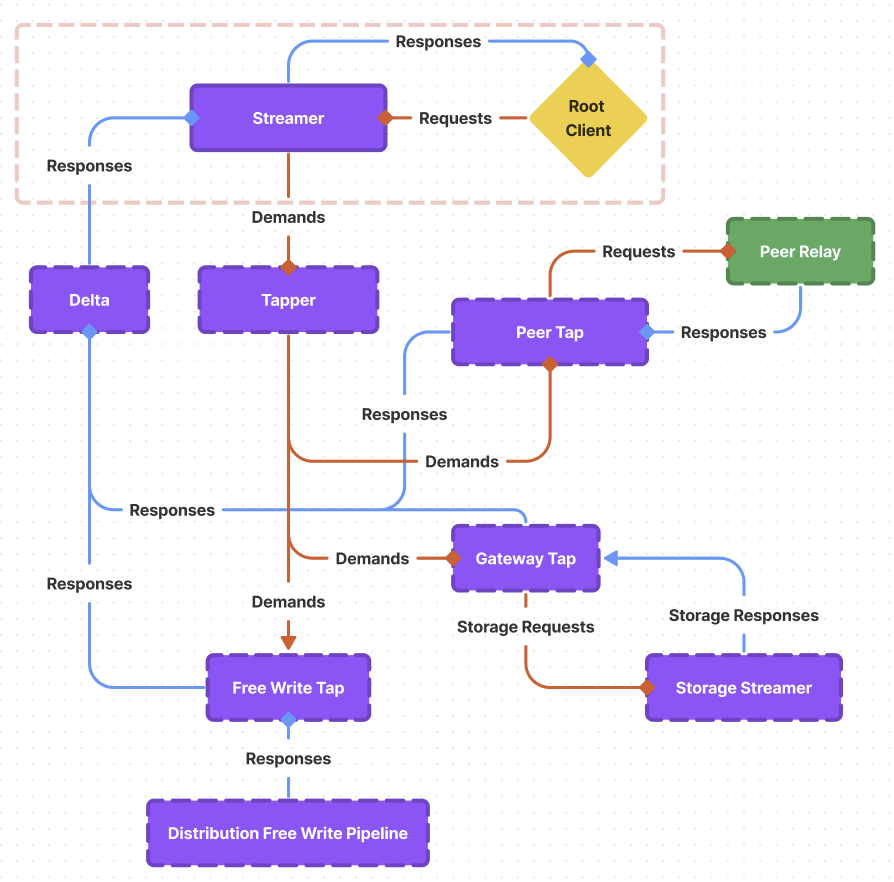

# Distribution Layer Relay

## 0 - Introduction

The distribution layer handles the real-time movement of telemetry throughout a Synnax
cluster. Specifically, it taps into the Synnax write pipeline, taking written frames and
forwarding them to a set of subscribers. As with the write and iteration pipelines, the
relay relies heavily on the use of goroutines and channels to move telemetry in an
efficient manner.

While this enables high performance, it adds complexity to the system, and we've needed
to resolve a number of subtle concurrency issues to achieve stability. This document
provides a detailed view into how the relay is structured and how both publishers and
subscribers smoothly disconnect and reconnect.

## 1 - High Level Structure

    

The relay has five main components:

### 1.0 - The Streamer

The streamer is the public interface to the relay, and a natural starting point for our
discussion. It is a confluence segment that receives requests containing a list of
channels that the caller desires to stream. It then sends responses containing received
frames of the desired telemetry.

The streamer forwards requests (now called `demands`) for channels to stream to the
tapper, which coordinates the opening and closing of taps. The streamer then receives
frames from the delta, filtering out any undesired channels, and then sends them back
out to the caller.

Each streamer is assigned a unique UUID that identifies it throughout its lifetime.

### 1.1 - The Tapper

The Tapper (`tapper`) receives demands (`demand`) from streamers to stream data. These
demands contain the unique identifier for the streamer and a list of channel keys that
the streamer wants to stream. The tapper aggregates the demands from all streamers and
uses them to figure out which taps it needs to open. A streamer can update its demands.
When a streamer is closed, it can also clear its demands.

### 1.2 - The Tap

The Tap (`tap`) comes in two flavors: a gateway tap and a peer tap. The gateway tap taps
into the hosts storage layer relay, while the peer tap streams data from a peers relay.
Taps are exclusively managed by a tapper. Taps receive requests from the tapper
containing a list of channel keys they should stream, and they send responses containing
received frames of telemetry. These frames are NOT sent back to the tapper, and are
instead forwarded to the delta.

### 1.3 - The Dynamic Delta

The dynamic delta is used to multiply responses received from taps to the streamers that
requested them. It is dynamic because streamers can be added or removed at any time.

### 1.4 - The Server

The final component is the `server`, which acts as the end of a peer tap existing on the
peer node. When a new peer tap is opened, the server opens a new streamer onto its own
relay, and forwards the frames it receives to the peer tap on the gateway. Through this,
any node can stream data from any other node.

### 1.5 - An additional note on Free Writes

Synnax v0.10 introduced a new channel type called a "Free Channel". Free channels are
not stored on disk, and have no leaseholder. This means that we can't tap into them in a
traditional manner. Instead, we directly expose the write inlet to the delta as part of
the relay (`Relay.Writes`). This lets the distribution layer write pipeline directly
write values for free channels to the delta, which then forwards them to the streamers.

## 2 - Component Life Cycles

## 2.0 - Relay Startup

The relay startup process is straightforward, and it all starts on a call to `Open`. The
startup process is as follows:

1. Create a new tapper and create a channel for it to receive demands on. We're going to
   pass this channel to any new streamers we create. When the tapper first gets opened,
   it will have no demands and no taps open.

2. Create a new delta and create a channel for it to receive frames on. We'll pass this
   channel to our tapper, so it can forward writes from taps to the delta. It's
   important to note that all taps push data into this single channel that the delta
   reads from. Blocking sends and receives on this channel are a major source for
   deadlocks in the relay pipeline. We'll discuss this in more detail in
   [Section 3](#3---avoiding-deadlocks).

3. Start the delta and tapper under a single `signal.Context`.

## 2.1 - Streamer Startup

A call to `Relay.NewStreamer` returns an unstarted streamer. The streamer startup begins
on a call to `Flow`, and is as follows:

1. Send a demand to the tapper containing the streamers unique address and the list of
   channels passed to `Relay.NewStreamer`. It's important that we make this call before
   attaching the streamer to the delta, as we don't want to block receives on the outlet
   channel given by the delta.

2. Attach the streamer to the delta. This will cause the delta to begin sending frames
   down the returned outlet channel. Beyond this point, we're at risk of deadlocking the
   entire relay, so we need to be careful.

3. Defer the shutdown of the streamer. See [the next section](#22---streamer-shutdown)
   for more details.

4. Move into streamer operation.

## 2.2 - Streamer Operation

Streamer operation is a single for loop and select statement. This process is delicate,
so be careful when making code changes here to prevent deadlocks. The selection process
is as follows:

1. Context cancellation, which does an immediate, hard shutdown of the streamer.
2. Frames on the outlet channel from the delta. The response from the delta contains
   series for ALL channels requested by ALL streamers, so we filter only the keys we
   want to send back to the caller. This process results in excess allocations, and is a
   big performance hit. See [Section 4](#4---performance-considerations) for more
   details.
3. Requests containing updated key sets to stream. We push these requests through the
   demand channel so the tapper can update its taps. If the caller closes this channel,
   we shut down the streamer.

## 2.2 - Streamer Shutdown

The streamer shutdown process is the same for both context cancellation and inlet
channel closure, and is as follows:

1. Disconnect from the delta. To do this, we first start a new goroutine that drains the
   response channel for the streamer. Then, we send a disconnect command to the delta.
   The delta will process our disconnect request and close the response channel. At this
   point, the goroutine we started will exit, and we've safely disconnected from the
   delta.
2. Send a demand to the tapper telling it to release the streamers demands.
3. Close the demands channel, reducing its counter (this is used to signal that all
   streamers have been shutdown and the relay can be closed).

## 2.3 - Relay Shutdown

Once a call to `Close` is made, the relay will begin its shutdown process. The first
step is waiting for all streamers to close. The responsibility for ensuring all
streamers are closed is on the caller. Once all streamers are closed, the tapper will
close the `demand` channel that is the inlet to the tapper. This will cause the tapper
to shut down, which will close the channel connected to the delta, which will cause the
delta to shut down.

# 3 - Avoiding Deadlocks

# 4 - Performance Considerations
