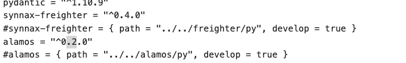
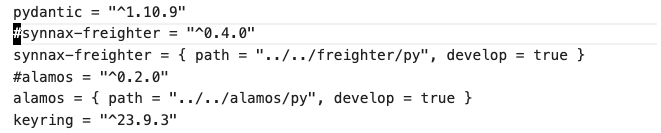

# Poetry - Synnax's Package Manager of Choice

## Python Version

Synnax uses **Python 3.10 or greater**, although we highly recommend always using the **latest version of Python**.

## Monorepo Organization

Synnax is organized as a monorepo. Our Python bases software consists of the following packageso

- `alamos` - path `alamos/py` - A library for instrumenting python code with
logs, traces, and metrics.
- `synnax-freighter` - path `freighter/py` - A transport adapter protocol
for communicating with the Synnax server.
- `synnax` - path `client/py` - The client library for communicating with
a Synnax cluster.

Each of these packages are developed built, and published independently.
The current dependency hierarchy for these packages is as follows:

<p align="middle">
    
    <h6 align="Middle">Synnax Python Dependency Graph</h6>
</p>

## Poetry - Synnax's Package Manager of Choice

We use [poetry](https://python-poetry.org/) as our package manager of choice. It helps
us:

* Correctly version all of our project dependencies. 
* Create virtual environments.
* Publish packages to PyPI.

While poetry can be considered a replacement for `pipenv`, it's not a replacement for `venv`. 
Poetry relies on the operating system level Python version to create virtual environments.

## The Development Process

### 0 - Prerequisites

Once you've set up your development environment (see [setup macos](../setup-macos.md) and
[setup windows](../setup-windows.md)), have an issue you're ready to work, and have
checked out a [branch](../git.md), you're ready to start developing.

### 1 - Uncommenting relative dependency links

Unlike Go or Typescript, Python has relatively poor support for monorepo development at
the moment. As a result, we need to do a little bit of manual labor to get things working.

Whenever we submit a pull request to the main branch, we need to ensure that all relative
dependency links are commented out and their absolute counterparts are uncommented. 
Otherwise, the package won't be publishable to PyPI or installable by any our users.

So, when you check out a new branch off of `main` and see the `pyproject.toml` file in
any of our libraries, you'll see some lines like these:

<p align="middle">
    
    <h6 align="Middle">Commented out imports in pyproject.oml</h6>
</p>

This is the `client/py/pyproject.toml` file. We have two dependencies that
have their relative links commented out (`synnax-freighter` and `alamos`). In order to develop these packages effectively, we need to uncomment these lines and comment out the absolute links, like so:

<p align="middle">
    
    <h6 align="Middle">Uncommented imports in pyproject.oml</h6>
</p>

You'll want to look for any commented out relative links in the `pyproject.toml` files in
`client/py`, `freighter/py`, and `alamos/py`. Uncomment them and comment out the absolute
links.

### 2 -  Installing Dependencies

Now that we've uncommented the relative links, we need to install the dependencies for
each project. To do this, run the following command in `client/py`, `freighter/py`,
and `alamos/py`:

```bash
poetry install
```

### 3 - Starting a Virtual Environment

Which of these three libraries (`client/py`, `freighter/py`, and `alamos/py`) do you
need to work on for your ticket? Once you've answered that question, move into that
library's directory and start a virtual environment:

```bash
poetry shell
```

This will let you run test cases (and in `client/py` the CLI).

### 4 - You're Ready to Go

You're ready to start developing with Python in Synnax. Note that certain libraries
have specific development instructions. These instructions can be found in the `README.md`
files in each library's directory.