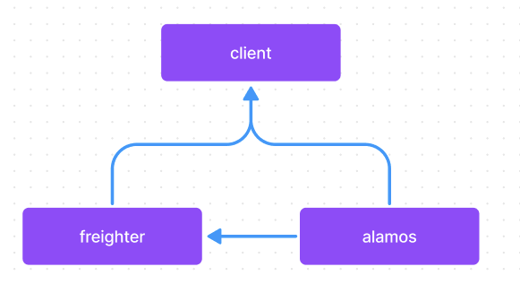

## Python Version

Synnax uses **Python 3.12 or greater**, although we highly recommend always using the
**latest version of Python**.

## Monorepo Organization

Synnax is organized as a monorepo. Our Python-based software consists of the following
packages:

- `alamos` - path `alamos/py` - A library for instrumenting python code with logs,
  traces, and metrics.
- `synnax-freighter` - path `freighter/py` - A transport adapter protocol for
  communicating with the Synnax server.
- `synnax` - path `client/py` - The client library for communicating with a Synnax
  cluster.

Each of these packages is developed, built, and published independently. The current
dependency hierarchy for these packages is as follows:

<p align="middle">
    
    <h6 align="Middle">Synnax Python Dependency Graph</h6>
</p>

## uv - Synnax's Package Manager of Choice

We use [uv](https://docs.astral.sh/uv/) as our package manager of choice. It helps us:

- Correctly version all of our project dependencies.
- Create virtual environments automatically.
- Publish packages to PyPI.
- Manage Python installations.

uv is a fast, modern Python package manager written in Rust that replaces pip,
pip-tools, virtualenv, and more.

## Workspace Configuration

The monorepo uses uv workspaces defined in the root `pyproject.toml`:

```toml
[tool.uv]
managed = true

[tool.uv.workspace]
members = ["alamos/py", "freighter/py", "client/py", "integration"]

[tool.uv.sources]
alamos = { workspace = true }
synnax-freighter = { workspace = true }
synnax = { workspace = true }
```

## The Development Process

### 0 - Prerequisites

Once you've set up your development environment (see [setup macOS](../setup-macos.md)
and [setup windows](../setup-windows.md)), have an issue you're ready to work, and have
checked out a [branch](../git.md), you're ready to start developing.

### 1 - Installing Dependencies

To install the Python dependencies, run the following command from the repository root
or from any package directory (`client/py`, `freighter/py`, `alamos/py`, `integration`):

```bash
uv sync
```

### 2 - Running Commands

uv automatically manages virtual environments. To run any Python command within the
project environment, use `uv run`:

```bash
uv run pytest    # Run tests
uv run black .   # Format code
uv run mypy .    # Type check
uv run sy --help # Run the CLI (in client/py)
```

### 3 - You're Ready to Go

You're ready to start developing with Python in Synnax. Note that certain libraries have
specific development instructions. These instructions can be found in the `README.md`
files in each library's directory.

## BEFORE YOU SUBMIT A PULL REQUEST

Once you're ready to submit a pull request, do two things:

1. Make sure you've bumped any changed libraries to their appropriate semantic version.
