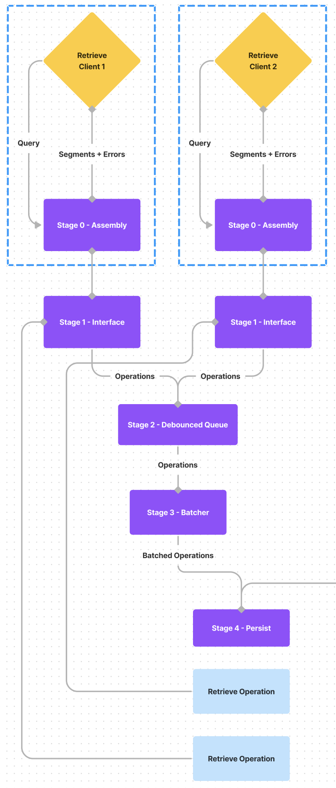

# 1 - Cesium - Channel Segment Storage Engine

- **Feature Name** - Channel Segment Storage Engine
- **Status** - Complete
- **Start Date** - 2022-05-17
- **Authors** - Emiliano Bonilla

# 0 - Summary

In this RFC I propose an architecture for a time-series storage engine that can serve as
Delta's primary means of data persistence. This proposal places a heavy focus on
interface as opposed to implementation details; a key goal is to define a sustainable
API that can serve as a clear boundary between Delta and an underlying storage engine.

This design is by no means complete, and is intended to be a starting point for
continuous iteration as Delta's demands evolve.

# 1 - Vocabulary

**Sample** - An arbitrary byte array recorded at a specific point in time. <br />

- **Channel**: A collection of samples across a time range.
- **Segment** - A partitioned region of a channel's data.
- **Regular** (in relation to time-series) - A 'regular' Channel is one whose samples
  are recorded at regular intervals (1Hz, 5Hz, 10Hz, etc.)
- **Samples/Second** - A basic measure of write throughput. The size of a regular sample
  should be assumed as 8 bytes ( i.e. a float64 value) unless otherwise specified,
  whereas an irregular sample is assumed to contain an additional 64 bit timestamp.
  Write throughput can also be expressed in terms of a frequency (1Hz, 5Hz, 25 KHz,
  1MHz, etc.)
- **DAQ** - Data Acquisition Computer.
- **Channel Cardinality** - The number of unique channel keys for a set of segments in a
  file.

This RFC expands on these definitions by asserting specific properties of a Channel,
Segment, and Sample. These properties are omitted from the above definitions as they may
fluctuate and affect storage engine implementation details.

# 2 - Motivation

The pivot from alpha V1 to V2 is the main driver behind this RFC. Synnax was built as a
database proxy that merged and synchronized network requests into several databases. V2
is a single binary that implements an entire database including a storage engine. This
means we must:

1. Find an existing embedded storage engine written in Go.
2. Write a new storage engine tailored towards Delta's specific use case.

Writing a database storage engine is quite an endeavour, so we'd ideally use an existing
one (or at least extend its functionality). The following analysis on existing solutions
ultimately led to a design that extends CockroachDB's
[pebble](https://github.com/cockroachdb/pebble).

# 3 - Existing Solutions

## 1 - Key-Value Stores

There are a number of popular key-value stores implemented in Go. Most of these are
inspired by earlier alternatives written in C or C++ such as
[RocksDB](http://rocksdb.org/) or [LevelDB](https://github.com/google/leveldb]). The
most popular are [badger](https://github.com/dgraph-io/badger),
[bolt](https://github.com/boltdb/bolt), and
[pebble](https://github.com/cockroachdb/pebble).

These all use an LSM + WAL style architecture, which is a good fit for frequent reads
and writes on small amounts of data. However, when it comes to high rate append only
workloads, they do not scale as well as one might hope. Pebbles' own
[benchmarks](https://cockroachdb.github.io/pebble/) show a maximum write throughput of
(approximately) 170,000 samples per second, far below V1's throughput of 6 million
values per second. An elastic throughput in the range several hundreds of millions of
values per second is reasonable for append only writes to an SSD.

It's naive to think we can reach comparable performance to slamming random bytes into a
disk, but it's not unreasonable to assume we can drastically improve on the speed of a
key-value store for a time-series only workload.

## 2 - Time-Series Stores

The embedded time-series storage options available in Go are limited. The most popular
I've found is [tstorage](https://github.com/nakabonne/tstorage), which is tailored
towards irregular time-series data. It's benchmarks shows a maximum write throughput of
about 3,000,000 samples per second.

Delta is unique in that almost all of its uses involve storing regular time-series data
(see [Restrictions on Time-Series](#restrictions-on-time-series)). This is a huge
advantage in terms of database simplicity and performance. `tstorage` doesn't take
advantage of data regularity, and is missing out on the benefits it provides.

## 3 - Distributed Key-Value Stores

Using a distributed key-value store seems like a great fit as it meets requirements for
both cluster wide metadata as well segmented telemetry.

[etcd](https://etcd.io/) is the most popular choice in this category, and can be run in
a pseudo-embedded mode using [embed](https://pkg.go.dev/go.etcd.io/etcd/embed). This
package allows for embedded bootstrapping of a cluster. Unfortunately, calls to the
key-value interfaces must still be done using a client over a network.

etcd uses Raft to achieve consensus, and replicates writes to all nodes in the cluster.
This means that write amplification scales along with the number of cluster members.
This is ok for small deployments, but quickly becomes a problem for larger clusters (the
authors of etcd advise against running a cluster with greater than seven nodes).

etcd's write amplification over the network is also problematic for large quantities of
data. It's unreasonable to expect a write throughput in the tens of millions of
samples/s for a cluster of seven nodes, even over a very performant network.

# 4- Design

The proposed design is named after [Cesium](https://en.wikipedia.org/wiki/Caesium), the
element most commonly used in atomic clocks. It focuses on simplicity by restricting:

1. The attributes of the time-series data that can be stored.
2. The available query patterns to a simple range based lookup (while still allowing
   future implementations to support more complex patterns).

Cesium expects certain queries to request 100+ GB of data, and uses a pipe based
architecture to serve long-running queries as streams that return data to the caller as
it is read from disk. This functionality is further extended to provide support for
client side iterators. Streaming queries are ideal for maximizing IO throughput by
allowing the client to transform or transfer data over the network as more segments are
read.

## 1 - Restrictions on Time-Series

Delta is designed to work with data acquisition hardware, and as such, must be optimized
for time-series data that arrives at predictable, high sample rates (25 KHz+). This is
very different a typical IOT use case with edge devices streaming low rate data at
unpredictable intervals. This is also different from an observability use case, where a
system can frequently discard old data. This is not the case in Delta, as telemetry must
be kept for extended periods of time.

### 1 - Channels

A channel's **sample rate** must be predefined. This is by far the largest restriction
and optimization that Cesium makes. When creating a new channel, the caller must provide
a fixed sample rate:

```go
cesium.NewCreateChannel().WithRate(100 * cesium.Hz).Exec(ctx)
```

Samples written to this channel are assumed to have a constant separation of 10ms
between them. Actual separations between samples are not validated or stored. Even the
most precise sensors and devices have minor irregularities in their sample rates (+/- a
few nanoseconds in the case of most data acquisition computers (DAQ)). Cesium leaves it
to the caller to decide whether fluctuations in the sample rate are acceptable.

This decision was made with the assumption that the precision of data recorded by a DAQ
is high enough that the consumer doesn't really care about the exact timestamp of a
particular sample. This assumption can be extended beyond the high rate hardware DAQ use
case to IOT or infrastructure monitoring workloads. Let's say a DevOps engineer wants to
monitor the number of requests to a particular API endpoint. The web server pushes this
data to a Cesium backed monitoring service at intervals of 5 seconds +/- 1 second.
Cesium would assume these values are written to the channel at even, five second
intervals e.g. 0s, 5s, 10s, 15s as opposed to 0s, 6s, 9s, 15s, etc. The DevOps engineer
probably doesn't care about the exact regularity of the data. oF course, there are times
when measuring precise intervals is critical. In these cases, Cesium is probably not the
best choice.

A channel's **data type** must also be predefined. This is typical for a time-series
database, but Cesium places no restrictions on the data types that can be stored. A
**data type** in Cesium is essentially an alias for its ** density** i.e. the number of
bytes per sample. For example, a caller could create a new channel that accepts
`float64` samples by setting the byte density to 8:

```go
// Setting the byte density manually.
cesium.NewCreateChannel().
WithRate(100 * cesium.Hz).
WithType(8 * cesium.Byte).
Exec(ctx)

// Using a pre-defined type alias.
cesium.NewCreateChannel().
WithRate(100 * cesium.Hz).
WithType(cesium.Float64).
Exec(ctx)
```

### 2 - Segments

The implications of these restrictions becomes apparent when designing **segments**. A
**segment** is a contiguous run of a channel's data. A segment stores the following
information:

```go
type Segment struct {
// Start stores a nanosecond precision timestamp of the first sample
// in the segment.
Start int64
// Data stores a set of regular, contiguous, binary encoded samples.
Data []byte
}
```

Because samples are regularly spaced, we only need to store the start time of the
segment. The timestamp of any sample can be calculated with the following equation:

<p align="middle">
    <br />
    
</p>

Where `D` is the density of the channel in bytes, `S` is the sample rate in Hz, and the
independent variable `n` represents the nth sample in the segment (the first sample has
index 0).

A segment places no restrictions on the amount of samples it can store. This has
important implications for both durability and write throughput. Larger segments are
less durable (written less frequently) but can achieve a higher throughput for both
reads and writes, as segment data is written contiguously on disk. See
[Data Layout](#data-layout) and
[Providing Elastic Throughput](#providing-elastic-throughput) for more details.

## 2 - Handling Arbitrary Data Types

Cesium places no restrictions on data type, and instead represents a type using a
**density**. This is atypical for a time-series database, but provides flexibility for
the caller to define custom data types such as images, audio, etc. Creating a custom
data type is as simple as defining a constant:

```go
// TenByTenImage is a custom data type where each sample is 10 * 10 * 3 bytes in size.
const TenByTenImage cesium.Density = 10 * 10 * 3

// Create a new channel that accepts samples of type TenByTenImage.
cesium.NewCreateChannel().
WithRate(100 * cesium.Hz).
WithType(TenByTenImage).
Exec(ctx)
```

:::caution Cesium does not plan to validate the data type. It's the caller's
responsibility to ensure that partial samples are not added to a segment. This is mainly
for simplicity and separation of concern, as the caller typically has more information
about the data being written than the storage engine itself does. This decision is
definitely not hard and fast, as adding simple validation is relatively easy (we can
assert `len(data) % Density == 0` for example). :::

## 3 - Extending an Existing Key-Value Store

Cesium's data can be separated into two categories: **metadata** and **segment data**.
Metadata is context that can be used to fulfill a particular request for segment data.
Segment data is the actual time-series samples to be stored, retrieved, or removed from
disk.

Instead of writing a storage engine that can handle both metadata and segment data,
Cesium proposes an alternative architecture that _extends_ an existing key-value store.
This store handles all metadata, and Cesium uses it to index the location of Segments on
disk.

This approach drastically simplifies Cesium's implementation, allowing it to make use of
well-written iteration APIs to execute queries in an efficient manner. Although the
actual key-value store used is of relative unimportance, I chose CockroachDB's
[Pebble](https://github.com/cockroachdb/pebble) as it provides a RocksDB compatible API
with well written prefix iteration utilities ( very useful for range based lookups).

There are a number of alternatives such as Dgraph's
[Badger](https://github.com/dgraph-io/badger). I haven't done any extensive research
into the pros and cons of each, as the performance across most of these stores seems
comparable.

## 4 - Streaming and Iteration

Optimizing IO is an essential factor in building data intensive distributed systems.
Running network and disk IO concurrently can lead to significant performance
improvements for large data sets. Cesium aims to provide simple streaming interfaces
that lend themselves to concurrent access. Cesium is built in what I'm calling a 'pipe'
based model as it bears a resemblance to Unix pipes.

Core vocabulary for the following technical specification:

**Stage** - An interface that receives samples from one or more streams, does some
operation on those samples, and pipes the results to one or more output streams. In a
[Sawzall](https://research.google/pubs/pub61/) style processing engine, a stage would be
comparable to an aggregator.

**Individual Stage** - An stage that is involved in serving only one request.

**Shared Stage** - An stage that is involved in serving multiple requests (i.e. several
input streams from different processes)

**Pipe** - A pipe is an ordered sequence of stages, where the output stream(s) of each
stage is the input stream(s) for the next stage. In Cesium's case, the ends of the pipe
are the caller and disk reader respectively (the order reverses for different query
variants).

**Assembly** - The processing of selecting and initializing segments for a particular
pipe. Assembly typically involves parsing a query, building a plan, and then
constructing the pipe.

**Execution** - The transfer/processing of samples from one end of the pipe to the other
i.e. the streaming process. Often times, the assembly process doesn't provide enough
information to fully execute the query, so the execution process parses additional
context within a sample to order additional transformations/alternative routing.

**Query** - The process of writing a structured request for pipe assembly and execution.
A query is often assembled using some sort of ORM styled method chaining API, packed
into a serializable structure, and passed to a processing engine that can execute it.

**Operation** - Cesium Specific - A set of instructions to perform on the disk. This can
be reading, writing, etc.

Cesium's query execution model involves a set of individual stages that perform
high-level query specific tasks, connected to low level batching, debouncing, queueing,
and ultimately disk IO stages.

### 1 - Retrieve Query Execution

A query with the following syntax:

```go
// res is a channel that returns read segments along with errors encountered
// during execution. err is an error encountered during query assembly.
res, err := cesium.NewRetrieve().
WhereChannels(1).
WhereTimeRange(telem.NewTimeRange(0, 15)).
Stream(ctx)
```

We're looking for all data from a channel with key 1 from time range 0 to 15 ( the units
are unimportant). We can use the following pipe:

**Stage 0** - Individual - Assembly - Parses a query and does KV operations to generate
a set of disk operations. Passes these operations to Stage 1.

**Stage 1** - Individual - Interface - Queues a set of disk operations and waits for
their execution to complete. Closes the response channel when all ops are completed.

**Stage 2** - Shared - Debounced Queue - Receives disk operations from an input stream
and flushes them to the next stage after either reaching a maximum batch size or a
ticker with an interval has elapsed. This modulates disk IO and improves the quality of
batching in the next stage.

**Stage 3** - Shared - Batcher - Receives a set of disk operations and batches them into
more efficient groups. Groups together disk operations that are related to the same
file, and then sorts the operations by their offset in the file. This maximizes
sequential IO.

**Stage 4** - Shared - Persist - Receives a set of disk operations and distributes them
over a set of workers to perform concurrent access on different files. This stage also
manages a set of locks on top of a file system to ensure multiple workers don't access
the same file in parallel. This stage is also shared with the create query pipe.

<p align="middle">
    
    <h6 align="middle">Retrieve Query Pipe</h6>
</p>

### 2 - Create Query Execution

A query with the following syntax:

```go
// req is a channel that sends segments for persistence to disk.
// res is a channel that returns any errors encountered during execution.
// err is an error encountered during query assembly.
req, res, err := cesium.NewCreate().WhereChannels(1).Stream(ctx)
```

We're writing a stream of sequential segments for a channel with key 1 to disk. We can
use the following pipe:

**Stage 0** - Individual - Assembly - Acquires a lock on the channel and does KV
operations for metadata context. Forks stage 1.

**Stage 1** - Interface/Parser - Receives a stream of create requests from the caller,
validates them, does KV operations for metadata context, and passes a set of parsed
operations to the next stage.

**Stage 2** - Debounced Queue - Same behavior as for
[Retrieve](#retrieve-query-execution).

**Stage 3** - Shared - Batcher - Receives a set of disk operations and batches them into
more efficient groups. Groups disk operations belonging to the same file, then groups
them by channel, and finally sorts them in time-order.

**Stage 4** - Shared - Persist - Same behavior as for
[Retrieve](#retrieve-query-execution). This stage is shared with the retrieve query
pipe.

<p align="middle">
    
    <h6 align="middle">Create Query Pipe</h6>
</p>

### 3 - Combined Pipe Architecture

<p align="middle">
    
    <h6 align="middle">Combined Cesium Pipe Architecture</h6>
</p>

Future iterations may involve inserting stages into the simplex stream between the
Operation and Interface stages to perform aggregations on the data before returning it
to the caller.

:::info It's also relevant to note that Cesium uses a large number of goroutines for a
single query. This is (kind of) intentional, as the database is optimized for high
throughput on fewer, large queries. See
[Channel Counts and Segment Merging](#7---channel-counts-and-segment-merging) for more
information how the number of open queries affects performance. :::

## 5 - Data Layout + Operations

### 1 - First Principles

When considering the organization of Segment data on disk, I decided to design around
the following principles:

1. Sequential IO is better than random IO.
2. Multi-value access is more important than single-value access.
3. Data is largely incompressible (i.e. it meets the requirements for Kolmogorov
   Randomness).
4. Time-ordered reads and writes form the overwhelming majority of operations.
5. Performant operations on a single channel are more important than on multiple
   channels.

### 2 - Columnar vs. Row-Based

There are two main ways to structure time-series data on disk: in rows vs. in columns.
In rows, the first column is a timestamp for the sample, and subsequent columns are
samples for a particular channel. The following table is a simple representation:

| Timestamp | Channel 1 | Channel 2 | Channel 3 |
| --------- | --------- | --------- | --------- |
| 15:00:00  | 1         | 2         | 3         |
| 15:00:01  | 4         | 5         | 6         |
| 15:00:02  | 7         | 8         | 9         |

A row can be represented as a tuple of values: `(15:00:00, 1, 2, 3)`. Each row is
serialized and saved to disk sequentially. This storage format is ideal for irregular
samples where channels are queried in groups i.e. the caller requests data for Channels
1, 2, and 3 at the same time.

Columnar storage, on the other hand, writes samples for an individual channel
sequentially. This is ideal for Delta's use case, as the timestamps of regular samples
can be compacted, and a caller often requests data for a small number of channels at
once. The following is a layout of a columnar segment on disk:

| 1   | 2   | 3   | 4   | 5   | 6   | 7   | 8   | 9   |
| --- | --- | --- | --- | --- | --- | --- | --- | --- |

This representation omits the following metadata:

1. Start timestamp of the segment
2. Key of the channel
3. Separation between samples (data rate)

An option is to include this metadata along with the segment:

| Key 1 | 15:00:00 | 25Hz | 1   | 2   | 3   | 4   | 5   | 6   | 7   | 8   | 9   |
| ----- | -------- | ---- | --- | --- | --- | --- | --- | --- | --- | --- | --- |

Adding this 'header' is the most intuitive way to represent the data, but has
implications for retrieving it. When searching for the start of a time range, Cesium
must jump from header to header until it finds a matching timestamp. For larger files,
this can be a costly operation. Instead, Cesium stores the segment header in key-value
storage along with its file and offset. When retrieving a set of segments, Cesium first
does a KV lookup to find the the location on disk, then proceeds to read it from the
file.

This structure also lends itself well to aggregation. We can calculate the average,
minimum, maximum, std dev, etc. and store it as metadata in KV. When executing an
aggregation across a large time range, Cesium avoids reading segments from disk, and
instead just uses these pre-calculated values.

### 3 - File Allocation

In order to prioritize single channel access, Cesium uses a file allocation scheme that
attempts to minimize the channel cardinality of a file. This is done using a round-robin
style algorithm. When allocating a segment to a file:

1. Lookup the file for the most recently allocated segment for the channel.
2. If the file has not reached a maximum threshold (arbitrarily set), allocate the
   segment to the file.
3. If the file has reached a maximum threshold:
   1. If Cesium hasn't reached a maximum number of file descriptors (again, arbitrarily
      set), allocate the segment to a new file.
   2. Otherwise, allocate the segment to the smallest file.

This process repeats for each segment written. Step 3.2 can be optimized further using
some weighted combination of the smallest file and the one with the lowest channel
cardinality. This adds complexity, and I'm planning on waiting until we have some well
run benchmarks to determine if it's necessary.

## 6 - Providing Elastic Throughput

OLTP databases are designed for high request throughput of small transactions. This
means latency is an extremely important factor. Cesium follows a different pattern. In
section [Segments](#segments), we placed no restriction on the size of the data slice
for a Segment. At its lowest capacity, a Segment holds only a single sample. When
writing single sample segments, Cesium will perform worse than a standard key-value
store (as it needs to do writes to both KV and disk) . This is less of an issue than it
seems. A single sample segment is most likely channelled with a low data rate (i.e. a
sample arrives every 15 seconds or greater). In this case, high performance doesn't
really matter. Even if we execute writes with an extremely low throughput of 1 sample
per second, we're still far below the threshold needed to satisfy the query.

As we increase the data rate of a channel, we'll also likely increase the size of an
individual Segment. Larger segments mean a few things:

1. Far less disk IO / sample.
2. Much larger contiguous runs of data for a single channel. This means a lot of fast,
   sequential IO.
3. Less KV operations needed for metadata (this applies to both create and retrieve
   queries).

These changes ultimately result in a much higher write throughput for channels with high
data rates (up in the hundreds of millions of samples per second for very large
segments). This also means that cesium can ingest massive amounts of data in migration
scenarios. The absolute limit for a segment is related to the maximum file size setting
and the amount of memory available to the database. A more practical limit is defined by
the maximum message size of a segment sent over the network (this is about 4 MB for
GRPC).

This so called 'elasticity' means that the throughput for a channel increases with its
sample rate. By adjusting other knobs in the database (such as debounce queue flush
rate, batch size, etc.) we can tune the 'curve' of this relationship to meet specific
use cases (for example, a 1Hz DAQ that has 10000 channels vs a 1 MHz DAQ that has 10
channels).

## 7 - Channel Counts and Segment Merging

A Delta node that acquires data is meant to be deployed in proximity to or on a data
acquisition computer (DAQ). This typically means that a single node will handle no more
than ~5000 channels at once. Cesium's architecture is designed with this in mind, and
can handle a relatively small number of channels per database compared to its
alternatives ( e.g. [TimescaleDB](https://www.timescale.com/), and
[InfluxDB](https://www.influxdata.com/)).

This is the main reason why Cesium allocates a large number of goroutines per query; the
optimization lies in throughput for a single query which can write to hundreds of
channels as opposed to many queries that write to a small number of channels.

Lower channel counts generally imply more sequential disk IO (as the channel cardinality
for a file is lower). If the maximum number of file descriptors is low, however, this
effect is negligible. Because channels are time-ordered, it's typical to expect high
cardinality in the input stream of a create query with a larger number of channels. With
a low descriptor count, we end up adding lots of discontinuities in a channel's data.

A potential solution is to re-order and merge Segments post-write (ensuring the DB is
durable while still maximizing sequential IO). The downside here is that we end up with
quite a bit of write amplification.

A segment merging algorithm could resemble the following:

1. Wait for a file to exceed its maximum size and be closed by the DB.
2. Query all segments in the file from KV
3. Group them by channel key.
4. Sort the groups by time-order.
5. Calculate new offsets for the position of each sorted segment.
6. Rewrite the contents of the file using the new offsets.
7. Persist the new segments to KV.

Segment merging is also useful in the case of low rate channels. Channels with samples
rates under 1Hz will write very small segments. This results in increased IO randomness
during reads (Low data rates -> more channels -> smaller segments -> high channel
cardinality -> frequent random access). By sorting and merging segments, we can reduce
both the number of kv lookups and increase sequential IO.

Segment merging also adds complexity. We go from a database that writes data once to one
that adds multiple updates and rewrites. Segment merging only occurs after a file is
closed. Recent data (which generally lives in open files) is typically accessed more
frequently than older data. Reads to recent data won't benefit from segment merging
unless the file size is drastically reduced. This leads to large numbers of files.

I'm deciding to leave segment merging out of the scope of this RFC's implementation.
This is not to say it doesn't belong in subsequent iterations.

## 8 - Iteration

Cesium is designed to serve queries with results well in the hundreds of gigabytes. This
data must be read from disk, processed, and sent over the network. It's reasonable to
assume that the client won't expect the entire data set to be returned before beginning
to process it. This is a great opportunity to provide iteration utilities that allow a
client to 'seek' through a channel's data.

This is particularly useful when the client wants to distribute processing across
multiple threads or machines. By providing some sort of server side iterator, we can
provide a concurrency safe mechanism for iterating over a channel's data.

This is also useful if a client doesn't have enough memory to hold an entire data set.
Instead, they can iterate over the segments in a channel, sending the transformed
results back to the server. That way, a client only needs to maintain a small section of
the channel's data in memory at once..

## 9 - Deletes

Like reads and writes, deletions are optimized for large ranges of data. Cesium employs
tombstones to mark data for removal. Retrieve queries will no longer consider these
segments as valid, and will avoid them when returning results.

A periodic garbage collection service will process tombstones and remove the data from
disk. The exact parameters for this removal process (i.e. interval, tombstone count
threshold, etc.) are yet to be determined. File size limits will have an impact on these
parameters, as larger files will result in more write amplification.

## 10 - Aggregation and Transformation

Whether to separate storage and compute within a database is an important design
decision ( see
[BigQuery](https://cloud.google.com/blog/products/bigquery/separation-of-storage-and-compute-in-bigquery))
. This division typically comes in the form of a network partition where one server is
responsible for storage and another computation, although I think it applies to embedded
databases as well. By providing simple aggregations (sum, min, max, avg), a database can
make use of low level optimizations to improve performance. On the other hand, leaving
these out leads to a simpler implementation (which is beneficial for obvious reasons).

To illustrate, let's say we have a channel that records data at 100 Hz, and we want to
compute the average across a time range. The simplest approach is to iterate over the
entire data set, average it, and then do what we want with it. In this case, it's the
caller's (i.e our) job to do the computation. Cesium does no transformations on data
internally (separated of storage and compute).

On the other hand, averaging a data set is a frequent task, and we can use a technique
along the lines of an SQL materialized view to pre-compute the average. There are two
ways of doing this:

1. The caller is responsible - Average every N samples and write them to a new, derived
   channel. This allows us to support arbitrary aggregations at the cost of transferring
   responsibility to the caller for keeping the average up to date. We also move
   complexity further up the call stack, reducing our options for low level
   optimization.

2. Cesium is responsible - Cesium averages every N samples in a segment on write (or
   shortly after) and stores them in metadata. When the average is requested, we can
   avoid the overhead of reading the entire segment, and can instead return the value
   from metadata.

The second option enables low level optimization by persisting common aggregations to
disk. The problem is that we've now coupled storage and compute, increasing the
interface footprint and overall complexity of the database. It's also difficult for us
to predict the common aggregations a user may request. We either need to provide an API
for configuring aggregation policies (increasing the interface complexity), or write
algorithms that analyze the patterns of our users (increasing the implementation
complexity).

These tradeoffs mean I'm deciding to leave aggregation outside of Cesium's scope for
now. As we learn more about Cesium's use case, we can revisit this decision.
