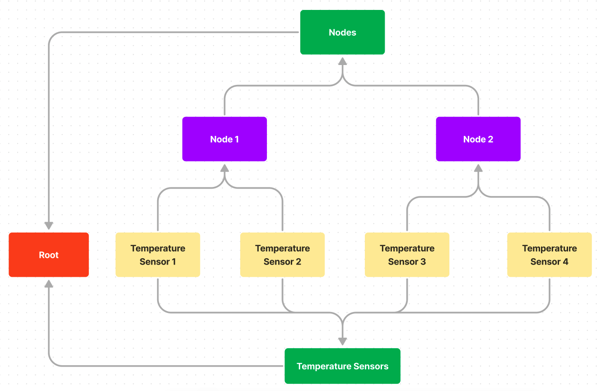

# 5 - MVP - Data Ontology

- **Feature Name**: MVP - Data Ontology
- **Status**: Complete
- **Start Date**: 2022-07-16
- **Authors**: Emiliano Bonilla

# 0 - Summary

In this RFC I propose a design for a data ontology that can be used to define and query
the relationships across Delta's various services. The architectural objective is to
separate the core algorithms operating on the data structures in a particular service
(segment iteration, channel command streaming, etc.) from the relationships those data
structures may have with other entities in the system.

The ontology is represented as a graph of vertexes and edges. The MVP objective is to
define an interface to this graph sustainable for long term expansion backed by a
rudimentary implementation.

# 1 - Motivation

The need for an ontology arose from the design of Delta's authorization system. Let's
say we want to block a user from writing segments to a particular channel. We can
naively approach the problem by binding a permission object to the user stating what
channels they have access to, and then add a gate somewhere in our segment write
pipeline that checks whether the user can perform the action. The fault in this design
is that validating the permissions of a user is _not_ core to the algorithms for writing
segments to a channel. By adding explicit permission checks to the pipeline, we expand
the scope of the segment writer beyond a single responsibility.

This problem appears in the user service as well. By adding explicit permission fields
and type definitions for a channel to a central `user.User` struct, we're laying the
foundation for managing the permissions of all types in the same manner. Pretty soon
we'll end up with a massive data container that depends on virtually every other package
in Delta. A large data structure with unrelated fields screams that we're going to run
into severe pain down the road.

And what if the user wants to define permissions beyond simple `user->resource`
relationships? For example, what if we want to prevent Node 1 from writing to any
channels on Node 2. Do we need to create a user account for Node 1? Do we need to
manually assign permissions for each channel? Does the user account need a password? How
do we even validate the permission? Answering these questions sustainably isn't possible
using the permissions scheme we've designed.

We'd ideally want to:

1. Remove permission fields from the `user.User` struct into a different `authorization`
   package.
2. Prevent our segment processing and user related functionality from explicitly
   depending on our `authorization` package.
3. Allow us to define arbitrary relationships between resources in the cluster without
   explicitly defining them in the code.
4. Allow different services to query and define properties on these relationships.

The need to establish abstract relationships extends beyond authorization schemes to:

1. Providing a navigable user interface and API for users. What if a user wants to see
   all channels belonging to a particular node? To a device? To a user or group? To a
   certain section of the network?
2. Communicating data changes to different services in the cluster.

# 2 - Design

## 1 - Overview

At its core, the ontology is represented by a directed, acyclic graph or
[DAG](https://en.wikipedia.org/wiki/Directed_acyclic_graph). This graph is composed of
vertexes and edges. Vertexes represent particular resources in the cluster (channel,
user, node, group, device, etc). The edges between vertexes represent a relationship
between them.

A caller can traverse the graph by following the relationships of a vertex. They can
also define new vertexes and edges, and assign properties to them (such as permissions).

It's important to note that the ontology does not store any concrete data. It's vertexes
and edges simply hold references to the particular service where the data can be
accessed from. It's not the responsibility of the ontology to provide implementations
for creating a new channel, device, etc. It's only it's responsibility to characterize
the relationships between (i.e. this channel belongs to this device which belongs to
this node when can be accessed by this group of users).

To make the ontology more semantic, I'm changing the names 'vertex' and 'edge' to
_resource_ and _relationship_. Vertex and edge imply that a particular service adding
vertexes to the ontology should understand that it's a graph. Resource and relationship
provide a simpler view by implying that two entities share a connection.

## 2 - The Directed Acyclic Graph (DAG)

As its name suggests, a DAG has two important properties:

1. Directed - Relationships between entities have a defined hierarchy. When we build a
   relationship between a node and a channel, we'd like to say that a channel _belongs_
   to a node (and definitely not vice versa).
2. Acyclic - There can be no closed loops in the graph. This prevents an entity from
   having a relationship with itself.

In many ways, a DAG is similar to a directory with shortcuts. When opening the command
line on a Windows machine from the desktop, the executable for the program is not
actually on the desktop, and is instead in some deeply nested directory underneath
'Program Files.' The shortcut is useful, however, for providing different points of
access for the same program.

The ontology's DAG works under the same principle. We know that a temperature sensor
channel belongs to a particular node, but we also know that the same channel could
belong to a group of 'temperature sensors' that span multiple nodes. Representing both
of these relationships in a tree is impossible, but it's easy to do in a DAG:

<p align="middle">

<h6 align="middle">A simple channel ontology represented as a DAG</h6>
</p>

The location of 'Temperature Sensor 2' can be represented my the path " /temperature
sensors/temperature sensor 2" or by "nodes/node 1/temperature sensor 2". Both of these
paths are valid and intuitive ways of navigating the ontology. It just depends on the
callers needs.

It's also important to note that although this graph has undirected cycles, it does not
have any directed cycles. If we were to introduce a directed cycle like the following,

<p align="middle">

<h6 align="middle">An invalid DAG with a directed cycle</h6>
</p>

the graph would lose its meaning; Temperature Sensor 4 belongs to the group temperature
sensors but the group temperature sensors is also a temperature sensor? A directed
acyclic graph allows us to define dynamic relationships between entities while
maintaining a well-defined hierarchy.

## 3 - Resources and Relationships

Resources and relationships are the two core data types of the ontology. A resource, or
vertex on the DAG, is a unique entity in the cluster:

```go
package ontology

// Type represents a particular category of resource in the cluster (channel, user,
// node, etc).
type Type string

// ID is a cluster-unique identifier for the resource, regardless of its type (this
// is why it's called an ID, and not just a key).
type ID struct {
    // Key is a unique identifier for a resource within its Type (i.e. unique to all
    // channels).
    Key string
    // Type is the type of resource.
    Type Type
}

type Resource struct {
    //  The ID for the resource.
    ID ID
    // Additional fields that aren't important to define right now...
}
```

A relationship, or edge on the DAG, is a directed relationship between two resources:

```go
package ontology

type RelationshipType string

type Relationship struct {
    From ID
    To   ID
    // Distinguishes different classes of relationships, such as parent-child, accessor
    // -accessed, etc.
    Type RelationshipType
}
```

The `ontology` package provides a builtin `ChildOf` relationship type that indicates
that `From` is the child of `To`.

## 4 - Services

If the ontology's DAG only stores references, where do we actually get resources? This
is where a service comes in. A service for a particular resource type serves as a
gateway to the underlying service where the resource is stored.

The MVP interface for a service is decidedly simple:

```go
package ontology

type Service interface {
    // Retrieve returns data for the resource with the given ID.
    Retrieve(ID) (interface{}, error)
}
```

Within the ontology, we can store a map of services for each resource type. As a caller
traverse the DAG, we can use the service to retrieve the data for a particular resource.
Of course, this means we need to extend the `ontology.Resource` type to support holding
resource data along with the reference.

### 1 - Integrating Resource Data

The process for retrieving resource data is as follows:

1. A caller traverses the DAG until they find a resource of interest.
2. The ontology does a key-value lookup for the appropriate service.
3. The service retrieve the data for the resource, and binds it to the
   `ontology.Resource` from the DAG.
4. The `ontology.Resource` is returned to the caller.

I've had quite a bit of trouble defining a good way to integrate resource data into the
`Resource`. On the one hand, I'd like the `ontology` package to have as little knowledge
and interaction with the concrete type as possible. On the other hand, I'm not a fan of
highly dynamic, untyped interfaces. The simplest, and most abstracted way to represent
the payload is:

```go
package ontology

type Resource struct {
    ID ID
    // Data can hold a struct, map, slice, etc. that represents the concrete resource ID
    // refers to.
    Data interface{}
}
```

If we're exposing the resource through an API, we can serialize the Data to JSON and
return it to the client, where they can parse the fields as they wish.

This approach is general and loosely coupled, but poses problems when the caller wants
to parse the data. This can be illustrated when attempting to implement an ABAC
authorization system. When defining a policy, how do we extract specific attributes from
the resource? For example, we may allow or deny access to a channel depending on its
`Channel.NodeID` field. The only way to access this field is through reflection, which
I'd like to avoid.

### 2 - String-Value Maps

Another approach is to use a `fiber.Map` styled design where the resource is stored in a
string-value map:

```go
package ontology

type Data map[string]interface{}

type Service interface {
    Retrieve(ID) (Data, error)
}
type Resource struct {
    ID   ID
    Data Data
}
```

This is marginally less abstract, but definitely more sustainable. Now we can use
key-access in our ABAC policies:

```go
package ontology

// Enforce - A very very very very crude example.
func Enforce(resource Resource) error {
    if resource.Type != "channel" {
        return errors.New("access DENIED")
    }
    nodeID, ok := resource.Data["nodeID"]
    if !ok {
        return errors.New("probably a bug")
    }
    if nodeID != 42 {
        return errors.New("access DENIED")
    }
    return nil
}
```

This is similar to the `fiber.Ctx.Locals()` implementation, where we can set arbitrary
key-value pairs and get them later. While it works, the idea of turning a struct into a
map makes me fee a bit woozy (kind of like injecting a bunch of random variables into a
context).

### 3 - Looking to GraphQL for Inspiration

In many ways, the ontology serves a similar purpose to a GraphQL wrapper around a set of
microservices. Of course, the ontology can also be used as an internal bus for
communicating data within the codebase itself.

GraphQL defines its resources using a Schema, where the properties (names, types,
validation rules, etc. ) are defined for each resource type. A user writes a collection
of schemas, and then uses them to query the API.

We can take a similar approach by extending the `Service` interface to ask for a schema
definition along with its data.

```
type Service interface {
   // Schema returns a schema describing the properties of the resource type.
   Schema() Schema
   ...
}
```

This could be particularly useful if we want to support resources writes through the
ontology, and could eventually allow for the creation of type-safe APIs.

### 4 - (Mild) Digression - Thinking Architecturally

I'd like to make note of an important distinction between a GraphQL interface and the
schema concept I introduced above. Many type-safe APIs (GraphQL, gRPC, tRPC, Swagger)
rely on custom languages to define their resources. These languages can then generate
code that can be imported and implemented into your general purpose language of choice.

If we're talking about using a type-safe API to communicate between two microservices A
and B, where A stores the resource (the 'server') and B queries it (the 'client'), I
think it's important to ask _who is responsible for defining the API?_.

Unless the server is specifically designed to support arbitrary data types and
relationships (like a database), I think it's prudent to assume the server is
responsible for letting the client know which resources it exposes. This establishes a
clear contract with a single source of truth.

This leads me to ask why we define our schemas in custom languages and them compile them
to GP libraries instead of defining them in their _native_ type and compiling them to a
custom schema language?

This approach adds complexity, as we need to add support for bidirectional code
generation, but it seems to do a better job of allocating single responsibility. It's
the type-safe APIs job to:

1. Tell the client what type of resources it exposes.
2. Transport resources to and from the server.

This doesn't mean it's the APIs job to _define the resources themselves_. Why don't we
do that in the microservice code itself, where the majority of the core logic lives?

This is the approach I'd like to try with the ontology, where it essentially serves as
an internal API between different services. Resources should _not_ be defined in the
ontology, but in the services that interact with it.

This approach may have unforeseen pitfalls. I guess we'll find out.

## 4 - Future Work

### 1 - Writes through the Ontology

Right now, we're only able to read resource data from the ontology. I think its
pertinent to consider whether we'd like to add support for writing to resources in the
future.

On the one hand, this transfers more responsibility onto the ontology for managing
resource data. On the other hand, we've already established strongly typed schemas, and
could use them to automatically create type-safe write APIs so that services don't have
to implement their own.

We won't know until we've put the existing design through its paces, so I'll lease this
as an open question.
