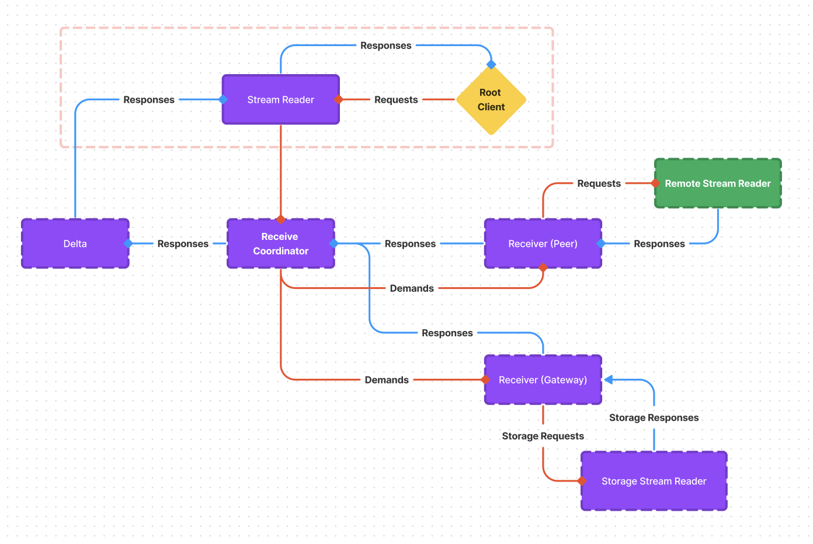

# 12 - Live Telemetry

- **Feature Name**: Live Telemetry
- **Start Date** 2023-05-01
- **Authors**: Emiliano Bonilla
- **Status**: Draft

# 0 - Summary

Live telemetry transportation lies at the foundation for any industrial control system.
Until now, Synnax's focus has been solely on distributed telemetry storage and
retrieval. While it has been used for plotting in real-time scenarios at rates of up to
1Hz, dedicated real-time infrastructure is necessary for supporting active control and
live visualization/analysis at higher data rates.

In this RFC I propose an architecture for integrating telemetry streaming into the
existing Synnax ecosystem. I'll discuss modifications to several existing components,
including the core read and write pipeline, as well as establishing several new
components to support real-time needs.

# 1 - Vocabulary

# 2 - Motivation

# 3 - Philosophy

# 3.0 - Leveraging Properties of Telemetry

Building an efficient telemetry engine starts with having a clear understanding of the
core characteristics of telemetry as it relates to hardware systems. We can leverage
these properties to define constraints that allow us to build simpler, more efficient
software while still providing our users with sufficient flexibility to meet their
needs.

This approach is not novel, and, most notably, has played a major role in the simplicity
of Cesium's storage architecture. As we extend our storage and distribution systems, we
need to keep leveraging these fundamentals to our advantage.

I've decided these are so important that they deserve a page of their own,
[here](/docs/tech/telemetry.md).

# 4 - Requirements

# 5 - Design

## 5.0 - Summary

## 5.1 - Event Channels

Event channels are built for two workloads: highly irregular, low volume telemetry and
multi-writer scenarios. The former allows us to support
[supervisory](/docs/tech/telemetry.md#33---supervisory-commands) control, and the latter
enables [real-time](/docs/tech/telemetry.md#32---real-time-commands) control by multiple
clients. Supporting this use case is critical for allowing human and auto-sequence
interoperability.

Event channels manage their own, independent index. As opposed to sensor data,
supervisory and real-time control issues typically have high timestamp cardinality i.e.
they are very unlikely to share timestamps with any other channel. As a result, it's
difficult to justify maintaining a completely separate index channel on disk. Instead,
we modify cesium to store the index for the channel with the channel's data itself.

Writes for index channels are buffered in a serialized cache, allowing for multiple
concurrent writers and minimizing the number of system calls to disk. Event channels
also have no commit process. Writers are committed to the database immediately.

### 5.1.0 - Sample Ordering

One of the challenges with channels that support multiple concurrent writers to the same
region of data is providing strong guarantees on write ordering for samples without
taking considerable performance hits. Take, for example, the following scenario:

1. Clients A and B open writers to the event channel `ch` with a cache size that holds
   50 samples.
2. Writer A sends 40 samples with the timestamp of the last sample being `30`, and
   writer B sends ten with the last timestamp being `25`. Samples are ordered within the
   cache on write.
3. The database flushes the write to disk.
4. Writer B sends another timestamp with the value `26`. Now our cache is holding a
   value that was sent before the final write on the previous flush. What do we do?

## 5.2 - Virtual Channels

Virtual channels are a special type of channel that are not backed by any data on disk.
They're used for two purposes: software signals and calculated values.

Aside from the channel definition, virtual channels completely bypass the storage layer,
and instead pass frames directly into the distribution layer
[relay](#531---distribution-layer), where they're propagated to any subscribers before
being garbage collected.

### 5.2.1 - Non-Leased Virtual Channels

For certain software signals, there's no reason to pin the channel lease on a specific
node. Common examples of this are changes to cluster membership and the creation,
modification, and deletion of labeled ranges. These signals are produced through the
change-data-capture (CDC) framework in Aspen, and, as a result, are emitted by every
single node in the cluster as opposed to a single one.

For these virtual channels, we can set the leaseholder field to `0`, which basically
says that values for the channel can be written to the relay from any node and are _not_
propagated to other nodes via the relay.

## 5.2 - Relay

One of the most significant changes to the frame pipeline involves adding a multi-layer
relay that allows subscribers to 'tap' into the write pipeline. At the storage level,
this relay taps off of `cesium.StreamWriter` to act as an observer to incoming frames.
The distribution layer extends this functionality to relay telemetry from other nodes,
exposing a monolithic telemetry streaming system to the service layer.

## 5.4 - Relay - Storage Layer

The storage level relay listens to incoming writes to cesium. The simplest way to
accomplish this is to have cesium implement the `observe.Observable` interface and
notify arbitrary subscribers of changes via `Notify` and the `OnChange` handlers.

Unfortunately, depending on which handlers are bound, synchronously notifying
subscribers on every frame write could cause considerable performance regressions under
high load. Forking a new goroutine for every notification is also clearly not an option,
as we'd have no way of sustainably tracking the lifecycle of these routines, and could
end up leaking many of them.

A bad solution is to notify subscribers through a heavily buffered channel. A channel
would be needed for each subscriber, and it's still possible to halt the entire write
pipeline if the channel buffer fills completely.

Solving this problem depends heavily on the delivery guarantees we're trying to satisfy:
Is it ok to drop frames or close hanging sockets to maintain a fixed capacity buffer
while making sure the write pipeline never gets clogged? Or should we allow for infinite
(within reason) buffering to give slow subscribers extensive leeway? The first is, in
principle, the less fault-tolerant and forgiving approach at the cost of performance and
missing subtle leaks.

A practical implementation for the first method would resemble the following:

```go
package irrelevant

func main() {
    // Relatively large buffer.
    ch := make(chan int, 1000)
    // A simple non-blocking send.
    select {
    case ch <- 1:
    }
}
```

Another option would be to introduce some sort of signal channel running in a separate
goroutine that we use to explicitly cancel a send operation after a certain amount of
time.

```go
package irrelevant

import (
    "log"
    "time"
)

func main() {
    t := time.NewTicker(5 * time.Second)
    ch := make(chan int, 100)
    last := time.Now()
    select {
    case ch <- 1:
        last = time.Now()
    case tick := <-t.C:
        // If more than five seconds have passed since
        // we had a successful send, abort the current
        // send.
        if time.Duration(last-tick) > 5*time.Second {
            log.Warn("Blocked Send")
            return
        }
    }

}
```

I'm slightly worried about the computational cost of the second option, as this routine
may be executing at several kilohertz for extended periods of time.

## 5.5 - Relay - Distribution Layer

The distribution layer extends the storage layer to relay telemetry from other nodes. It
leverages similar routing functionality to both the `framer.iterator` and
`framer.writer` services, using channel keys to resolve leaseholders and open streaming
connections. It's interface exposes a cluster-wide monolithic relay that allows callers
in the service and API layers to access live channel data without being aware of the
cluster topology.

The distribution layer relay has one crucial difference from the two services mentioned
above: it multiplexes requests for live telemetry across a single stream. Unlike writers
or iterators, relay reads have no-cross node state to maintain, and all consumers of the
relay are accessing filtered views of the same data. Instead of opening a socket for
each reader that needs to consume from the relay, we keep track of the channels each
reader wants to receive data for. These channels are called demands. When a new reader
wants to consume frames, it sends the relay a demand request. The gateway relay
normalizes the demands from each reader, and opens a new socket to a peer relay or the
gateway's storage layer relay. Responses are then multiplied to each consumer relay,
where they are filtered only for the channels that the reader requested.

<br />
<p align="middle">
    
    <h5 align="middle">Distribution Relay</h5>
</p>

The impetus is that the **number of telemetry readers is much larger than the number of
writers**. With this approach we can drastically reduce read amplification between peers
in the cluster, and hopefully minimize congestion in the storage layer write pipeline as
well.

# 6 - Future Work

## 6.0 - Framing Flight Protocol

Profiling Synnax in production since the `v0.1.0` release has shown that
serialization/deserialization has the greatest impact on frame read and write
performance. Telemetry streaming leads to many more, considerably smaller frames than
post-processed writes and bulk ingestion. Implementing an efficient flight protocol for
telemetry frames is a priority for achieving high throughput and efficient resource
utilization.

## 6.1 - Anti-Jitter

Latency and jitter play a critical role in over the network real-time control. In
uncontrolled networks, latency and jitter are largely out of the control of the
software. As network conditions improve, the software design itself begins to play a
more important role. As a highly concurrent, garbage collected language, Go is not ideal
for maintaining low jitter. As a result, we may need to implement jitter reduction
algorithms in order to provide stronger guarantees on execution time. Naturally, these
algorithms should be accompanied by extensive profiling.

## 6.3 - Variable Size Samples

While relevant for supervisory control, I've left handling channels with variably sized
samples out of scope for this RFC. I think it's important to consider the level of
granularity with which we need to handle these data types: should they have a strongly
typed schema? Or should we only accept variably sized binary or JSON type channels, and
leave it up to the user to enforce any schema they may require? This is a question that
requires gathering user feedback.
