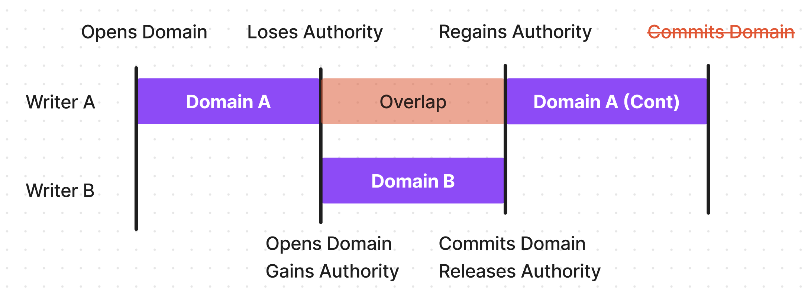

# 14 - Control

- **Feature Name**: Control
- **Start Date**: 2023-08-09
- **Authors**: Emiliano Bonilla
- **Status**: Draft

# 0 - Summary

In this RFC I propose a design for implementing the foundational elements of a control
system in Synnax. While the current Synnax version as of this writing (0.8.0) is capable
of streaming telemetry data for control purposes, it lacks some of the essential
facilities for enabling over the network control; most notably, the ability to negotiate
control over a channel between multiple clients in real-time.

This RFC begins with a discussion of the modifications needed to the Synnax server from
a high-level, structural perspective. As always, there are many ways to implement the
same functionality, and the subsequent sections of this RFC focus on the benefits and
drawbacks of the most promising approaches. Finally, I propose one of these approaches
and discuss its design in detail.

# 1 - Vocabulary

- **Sample** - An arbitrary byte array recorded at a specific point in time. Typically
  an event or reading of a sensor or actuator.
- **Channel** - A logical collection of samples across a time range. Most often emitted
  by a single source.
- **Virtual** - Not persisted to disk - usually a channel.
- **Leaseholder** - The node in a Synnax cluster responsible for accepting writes for a
  specific/channel.

# 2 - Motivation

Implementing a robust control system is one of the final, large features left in the
development of Synnax beta. More details on the motivation for this feature can be found
in the [control PSD](../../product/psd/0002-230610-control.md).

# 3 - Philosophy

## 3.0 - Commands and data use the same infrastructure

Maintaining a single read and write path for both commands and data is a core design
principle of Synnax. By using the same underlying infrastructure, we can not only reduce
internal complexity, but we can also simplify the APIs we provide to users.

This is not to say that high-level fixtures that are control or data specific, such as
auto sequences, cannot be built on top of the core data movement/storage systems. At
it's core, however, Synnax should remain as a real-time, distributed time-series
database that can be used effectively in scenarios that don't involve control.

## 3.1 -

# 5 - Detailed Design

## 5.0 - Control Authority

Multi-entity client control requires a method of determining which clients have control
over a channel at any given time. This RFC introduces a new type, `control.Authority`
that is a simple, unsigned 8-bit integer with a few simple rules:

1. A client with a higher authority can prevent a client with a lower authority from
   writing to a channel.
2. A client with a higher authority can take control of a channel from a client with a
   lower authority.
3. A client with higher control authority can release its control over a channel, at
   which point the client with the next highest authority will take control of the
   channel.
4. The behavior of clients with equal authority can be configured at the channel level.
   Channels can allow multiple clients with equal authority to write to them, or they
   can only allow the **first** client to acquire control to write to them.

## 5.1 - The Challenges of Implementing Control Transfer

The most difficult problem in this design involves smoothly transitioning control
between two clients while maintaining data integrity on disk. Imagine the following
scenario:

1. Writer A with control authority 1 starts writing data to a channel, opening a new
   domain in Cesium.
2. Writer B with control authority 2 wants to take control of the channel. Writer B now
   opens a domain starting at the current end of writer A's domain and starts writing
   data.
3. After writer B is finished, it commits its domain, closes, and releases control back
   to writer A.
4. Writer A adds more data to it's existing domain. Any subsequent writes will result in
   an overlap between writer A's domain and writer B's already committed domain, and
   cesium will reject any new commits to writer A.

To clarify the above steps, see the following diagram showing the sequence of events
resulting in the eventual overlap shown in shaded red:

     
    
    <h6 align="middle">
        Fig 1: Example of a domain conflict resulting from a control acquisition and subsequent
        release between two writers.
    </h6>

We'll discuss a few solutions to this problem, all of which have their benefits and
drawbacks.

### 5.1.0 - Introducing a storage-layer mutexed write buffer/streaming cache

### 5.1.1 - Closing unauthorized writers on transfer

### 5.1.2 - Transferring ownership of the domain
