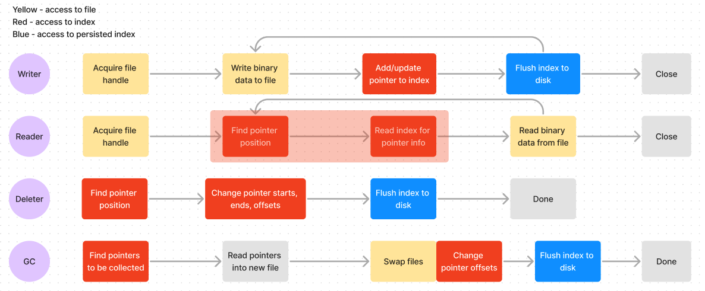

# 1 - Cesium - Channel Segment Storage Engine

**Feature Name** - Channel Segment Storage Engine  
**Status** - Draft  
**Start Date** - 2024-03-10  
**Authors** Leo Liu  

# 0 - Summary

In this RFC I discuss the nuances of Cesium's concurrency. More specifically, how it handles race conditions across its different operations.

# 1 - Vocabulary

**Thread** – An execution of program independent of others. In Go, a thread is implemented as a goroutine, which is more lightweight and compact.

**Concurrency** - Multiple threads(goroutines in the context of Go) running at the same time in parallel

**Mutex** - Mutual Exclusion, i.e. only one running at once

**Deadlock** - When two threads wait for each other to finish running or to release some Lock, therefore become stuck forever

# 2 - Motivation

Cesium-based atomic clocks are "the most accurate realization of a unit that mankind has yet achieved." By extension, Cesium, the database named after the element in question, must also be accurate. This is challenging, however, due to Cesium's concurrent nature. When multiple subprocesses(goroutines) are to apply operations on the database, it is vital to handle these potentially conflicting operations in an orderly and predictable manner.

As Cesium looks to become production-ready, this task becomes more important as Cesium must support Read operations, Write operations, and Delete operations (through a tombstone/garbage-collection system). All of the operations must coexist without conflicting each other: for example, we obviously do not want two writers writing to the same file, but it's totally fine to read from a file in the first 100 bytes, while a writer in append-mode is writing to byte 150 and onward.

# 4- Design

The core method through which concurrency is protected is the *Mutex*.

The Mutex allows for operations of threads (going forward, I will refer to these as goroutines in the specific context as go) to be MUTually EXclusive. In other words, if one goroutine acquires a mutex (by calling `mu.Lock()`, all other goroutines trying to acquire it must wait until it is freed, i.e. `mu.Lock()` will block until the first goroutine releases the Mutex, i.e. `mu.UnLock()`. In addition, one goroutine may acquire a Read-Lock only (`mu.RLock()`), which allows other goroutines to acquire Read-Locks, but no goroutine may acquire a write-Lock.

# 4- Analysis

## 4.1 Top-down view of race conditions in Cesium

Protecting the integrity of data in Cesium is crucial. The three shared resources that we cannot allow concurrent access to are data stored on the file system, the index stored in memory, and its persisted counterpart on the file system. We will spend most of our time talking about the first two, since the persisted index is never read from until the database is closed and reopened.

We will consider which resources each operation needs to access, and in what order. Consider the following diagram:

    
    <h6>Cesium Entities and Resources</h6>

We can see that every operation uses the telemetry data in file system, the index, or one of the two – additionally, if the index is modified, it must be persisted to the file system as well. Throughout this RFC, we will discuss which red-coloured operations can occur at the same time, and how, and which ones cannot. The general principle we will abide by is that while one goroutine modifies some information, no one else should read or write from it. If no goroutines are writing to the resource but all are merely reading from it, that is acceptable, since all goroutines read the same information.

### 4.1.1 Write-Read contention

We will now examine the race conditions that might occur in a write-read contention, i.e. when writes and reads are happening at the same time. We first consider the changes to the file system: since each writer writes to a file in append mode, i.e. after all known domains of telemetry, and each reader can only read over known domains of telemetry, we will never have to read, in a file, sections that are being written to. This means that there are effectively no file conflicts in a write-read contention situation.

The race conditions in the index is more complex in a write-read contention: both operations require access to the index, and the regions of access may even be conflicting: consider a write to in between two domains. This is fine since read does not modify the data, in fact, this can be argued to even be desriable since the reader can be up-to-date with the newest-written telemetry.

### 4.1.2 Write-Delete contention

Deletion does not actually remove anything from the underlying telemetry data, so we can only focus on index. Deletion rewrites the pointers where the start/end timestamps are found, removes all pointers in between. Since both the delete and write operations must access the offset and length fields of the pointer, allowing these two operations to happen at the same time results in corrupted data: data that is either correct for deletion, or correct for writes. This means that not allowing the data to be changed at the same time is not enough – we cannot even allow the two entities modifying the data one by one. (talk more about this) Therefore, we rely on the controller to not allow deletion of any timerange that could be written to. This way, we can guarantee that the two entities are accessing different parts of the mutex.

### 4.1.3 Write-GC Contention

Both of these entities access the index and the underlying file system, however, garbage collection must occur in a strictly different file than write, since the writer would only write to files not already full, and garbage collection only occurs in a file that is already full.

### 4.1.4 GC-Delete deletion

Deletion does not change the underlying file, but may change the index. GC changes the index, but only for the field of length. We also know that there cannot be more pointers on a file after GC compared with before, therefore this conflict can just be handled by the mutex of the index.

## 4.2 Bottom-up view of race conditions in Cesium

We will now inspect, from the bottom up, how the various entities interact with the domain data and the index in memory.

### 4.2.1 Reading

To read a piece of telemetry data on the
