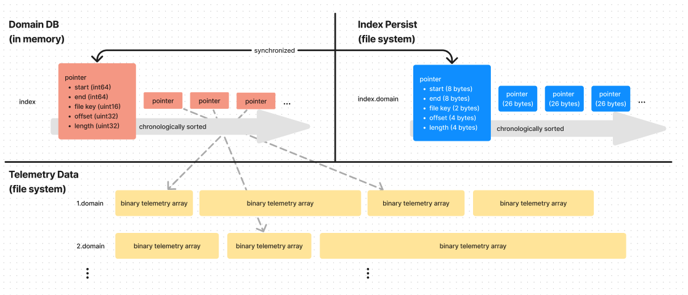
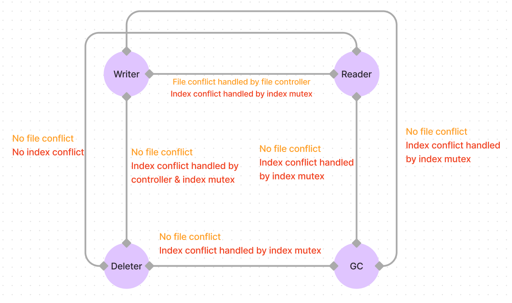
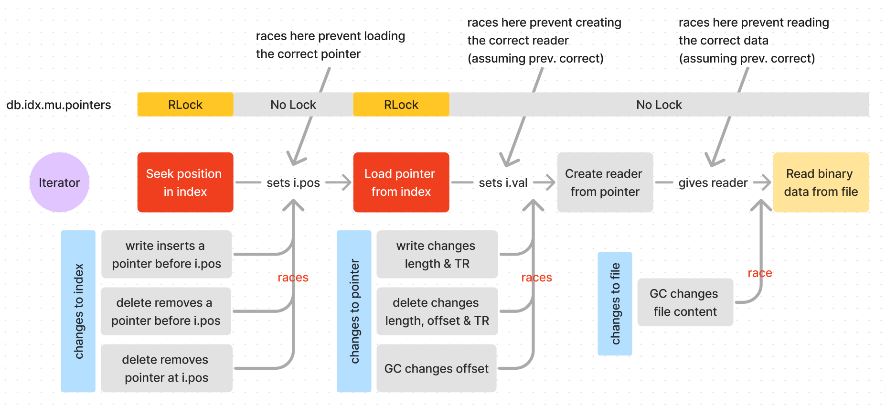
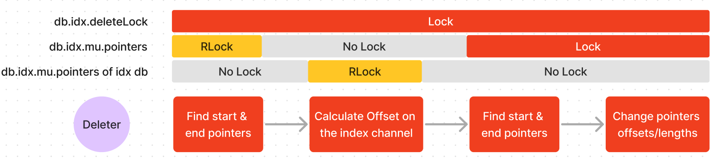
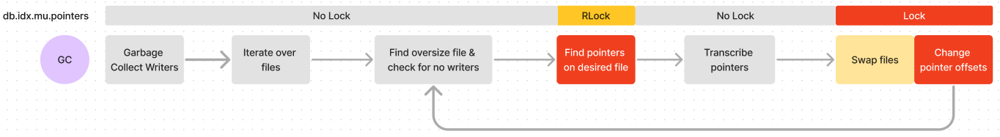
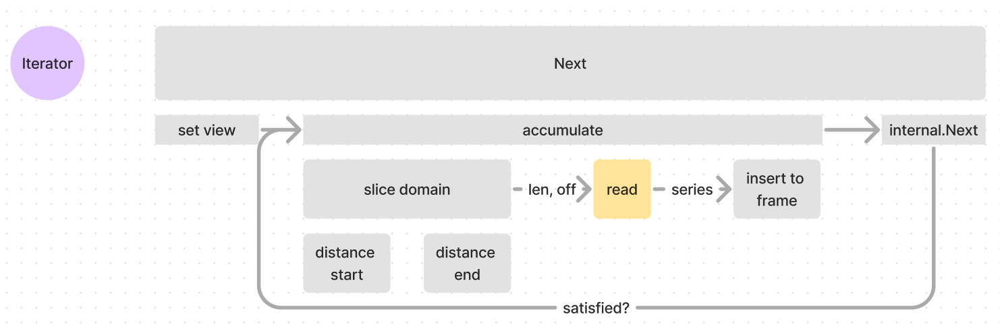

# 19 - Cesium Race Conditions

**Feature Name** - Channel Segment Storage Engine  
**Status** - Draft  
**Start Date** - 2024-03-10  
**Authors** Leo Liu  

# 0 - Summary

In this RFC I discuss the nuances of Cesium's concurrency.
More specifically, how it handles race conditions across its different operations.

# 1 - Vocabulary

**Sample**: A sample is a strongly typed value recorded at a specific moment in time – i.e.
a data point in Cesium.

**Channel**: A channel is a logical collection of samples that are time ordered and share
the same data type. Typically, a channel is used to store a time-series collection of
samples from the same source, e.g. a sensor.

**Index (Channel)**: In a channel, we may find many samples, but the samples don't make
sense unless we know what time stamp each sample corresponds to (is recorded at). An index
_indexes_ a channel by associating a time stamp to each sample.
It does not make sense to query the data at 00:05 out of [10, 30, 23, 90], but it does
make sense when we know that those samples correspond to [00:03, 00:04, 00:05, 00:10].
It is necessary that each channel has an index, and note that the index itself is a channel.

**Telemetry data**: At its core, all of Cesium's samples are stored as binary data on
the file system. Samples of the same [data type](0007-220823-data-type.md) occupy the same number of bytes: for example,
to read data from a file containing int64 data, we simply read every 8 bits and convert
each one into decimals (little endian by implementation) to recover the samples.

**Domain**: A domain is a time range with many samples stored contiguously in the same file.
In Cesium, domains may not overlap each other.
Domain is a powerful concept because it allows us to make statements about a group of samples
as opposed to one sample: if we know that the time range 10:00 - 12:00 as a whole is
stored in file 1 from offset 10 with length 10, and we want to find the sample at 11:00,
we know exactly where to look for it – this prevents us from searching the entire database!

**Domain DB**: The Domain DB is the lowest layer of
abstraction in the Cesium database: it directly interacts with the file system and
is responsible for storing and retrieving telemetry data from files.

**Pointer**: A pointer is the concrete structure of a domain: a pointer stores the time
range of the domain and where to find data for the domain in the file system
(file key, offset, length).

**Index (Domain)**: (not to be confused with an **Index Channel**)
The index in a domain DB is a chronologically-sorted slice of pointers stored in memory.
The pointers are sorted by their time range **and no domain may overlap each other** – it
does not make sense for a given moment in time to have more than one sample. The index
allows us to find the _domain_ that contains a given time stamp (and does this fast via
binary search) – or the lack thereof.

**Index Persist**: Index Persist is the "backup" of the index to disk. Suppose the
database closes then reopens and content in the memory is erased – we can no longer find
data as we no longer have index in our memory. Index Persist is an exact replica of the
index on the file system to prevent this issue: if the index is lost, we can always reload
it from the persisted version. Index persist must be closely up-to-date
with the index – however, there is a tradeoff between persist frequency and performance.
Each pointer is encoded into 26 bytes, and the entire slice of pointers is stored in the
`index.domain` file.

    
    <h6>Domain-level concepts</h6>

# 2 - Motivation

Concurrency is a double-edged sword: while it could make Cesium blazing-fast, it introduces
additional complexity through parallelism – when many subprocesses run at the same time,
they create conflicts, or race conditions, when they attempt to access common resources.
As Cesium looks to become production-ready, it is crucial that Cesium must support
Read, Write, and Delete (through a tombstone/garbage-collection system) operations
at high speeds without them conflicting each other. One can imagine the possible
consequences for unhandled race conditions in extreme scenarios such as launch control systems:
it would not be desirable.

# 4- Analysis

## 4.0 Primer on the structure of Cesium

At the highest level of abstraction, Cesium provides one unified interface to read, write,
delete, and stream data from multiple channels.
A Cesium DB comprises many channels, each one of which corresponding to a virtualDB
or an unaryDB. A virtualDB contains no data, so it will not be a topic of our discussion.

A unaryDB is a second level of abstraction in the database structure: it is composed of
a domainDB and an index: the index is responsible for resolving locations of data, whereas
the domainDB is responsible for storing it.

A domainDB is the lowest level of abstraction: it provides means to write and read data from
the file system, and maintains the index (see concepts).

Each layer has their own entities and methods of reads, writes, deletes, and garbage collection;
all interactions are passed down to the domain level to interact with the index and file system.

## 4.1 Top-down view of race conditions in Cesium

Protecting the integrity of data in Cesium is crucial.
The three shared resources that we cannot allow concurrent access to are data stored on the file system,
the index stored in memory, and its persisted counterpart on the file system.
We will spend most of our time talking about the first two,
since the persisted index is never read from until the database is closed and reopened.

Each one of the read, write, delete, and garbage collection operations is a combination
of accesses to the index and telemetry data. In the following diagram, we consider the
life cycle of each of these operations and which resources they need to access.

    
    <h6>Cesium entities and resources</h6>

We can see that every operation uses the telemetry data in the file system,
the index, or one of the two – additionally, if the index is modified,
it must be persisted to the file system as well.
Throughout this RFC, we will discuss which red-coloured operations can occur at the same time,
and how, and which ones cannot.
The general principle we will abide by is that while one goroutine modifies some information,
no one else should read or write from it.
If no goroutines are writing to the resource but all are merely reading from it,
that is acceptable, since all goroutines read the same information.

### 4.1.1 Contentions with reading

Read operations are carried out through an iterator, which only reads one chunk of telemetry
data at a time.
This means that every time the caller reads a block of telemetry data,
it first gets the information about the location and length of the data in the file system,
then uses that information to read on disk.

With this approach, the caller must understand that if the index was changed between two domains –
say, the iterator was on position 1, and on a call to `Next()`, it moves on to position 2.
However, a writer inserts a new domain between the two, meaning that the iterator thinks it is on position 2,
when in reality it loaded the domain at position 3.

Other than this race condition with the index that the user must beware of,
read does not conflict with any other operations as it does not change the index nor the underlying data.

### 4.1.2 Write-Delete contention

Deletion works by rewriting the pointers where the specified time range's start and end
time stamps are found, and removing all pointers in between.
Deletion itself executes no disk operations on telemetry samples in the file system. Instead,
it accomplishes the 'deletion' by directly changing the index.
so we only need to consider the concurrent operations on the index by the writer and the
deleter. We will discuss the two cases: either the writer may write data to the range
requested to be deleted, or it may not.

In the case that the writer may not write to the deleted time range, the mutex on the index
is sufficient to handle the concurrent writes as the writer and deleter are necessarily
writing to different parts of the index, so there will be no conflicts.

The case where the writer may write to the deleted time range, however, will cause index
conflicts: if the write operation happens first, then a new domain will be inserted and
it will be deleted from the deletion operation. However, if the deletion operation happens
first, then there will be a chunk of written data in the time range despite the delete call.
This is not the behaviour we want. Since we cannot know, if called concurrently, whether
the delete happened first or the write, we use the controller to disallow all deletes
to a time range that a writer may write to.

### 4.1.3 Write-GC Contention

Both the writer and the garbage collector modify the underlying data as well as the index.
In addition, since garbage collection is fundamentally a secondary operation (compared
to reads, writes, and deletes), it should not affect those operations – it is unrealistic
to disallow reads and writes while garbage collecting.

there are major conflicts between a writer and GC: Garbage Collection is strictly only
run on a file that is over size and with no writers currently writing to it.
This means that no writer can write to a file currently being garbage collected.

In the index, since GC only modifies pointers on the file being collected, it will not
change any pointers being written to by the writer, as it is necessarily not on the file,
for reasons mentioned above.

These conflicts are taken care of by the file controller and the mutex, and
there are no additional actions needed.

### 4.1.4 GC-Delete Contention

The deleter does not modify the data in the file system, so we will only discuss the index.
Unlike the writer, the deleter may perform operations on the pointers currently being
garbage collected.

The conflict arises when both entities attempt to change the offset of a file: delete
must change this to account for deletion after the start of a domain to only take in
a part of the data; GC must change this to store the new position of the data in the
file system. Both changes to the offset are with respect to the existing value:
both operations change the offset by adding (delete) or subtracting (GC) some bytes
to the existing offset. Therefore, it does not matter which one happens first. This way,
GC and delete can work in tandem, so long as the modifications happen one by one and not
at the same time, which is handled by the mutex on the index.

### 4.1.5 GC-GC Contention

If two garbage collection subprocesses run at the same time, we risk a serious data race:
the underlying data in the file system may be modified by two entities at the same time,
and the offset will be in a bad state.

### 4.1.6 Delete-Delete Contention

There are two cases for delete-delete contention: either the two time ranges contend over
the same pointer(s), or they are disjoint: the case where they are disjoint is simple: we
can simply use Mutex Locks to turn the operations into serial operations to the index and
there would be no conflicts (see the detailed deletion section 4.2.3).

If the two deletions contend over the same pointers, there are two more cases: the two
time ranges could overlap each other, in which case the controller at the Unary level would
return an error and disallow the deletion, or they don't overlap each other, in which case
the operation is turned into a Serial operation of the index (see section 4.2.3).

The following diagram summarizes possible conflicts between these entities:

    
    <h6>Cesium entities' interaction</h6>

## 4.2 Domain level race conditions

We will now inspect, from the bottom up, how the various entities interact with the
domain data and the index in memory. The domain level is responsible for managing the
underlying file system and the index. A domainDB is index-agnostic: it knows nothing
about the time stamps that these samples correspond to.

Dimensional analysis is a great tool to reveal nature of data we are dealing with: it
is very helpful to remember that data written and read from at the domain level are simple
**byte arrays**.

### 4.2.1 Writing

A write proceeds in three phases:
1. Acquire a writer (getting a file handle to an existing file or opening a new one)
to an underlying file that still has space for more data.
2. Write the binary telemetry data to the file handle.
3. Commit the writer, i.e. add a pointer in the index storing the time range represented
by the data and the location of the data in the file system (file key, offset, length).

Cesium is different from other Database systems in that a writer may be
committed multiple times: a writer may repeat steps 2 and 3, i.e.

4. Write more binary telemetry data to the file handle
5. Commit the writer, i.e. update the pointer that previously described the domain
written by this writer to contain the new domain.

In Synnax version 19, file cutoffs were introduced, which upon a writer writing to a file
that reaches its size limit, automatically ends the domain and begins a new one. We must
also consider the creation of this new pointer when analyzing for race conditions.

#### 4.2.1.1 Acquiring a writer

When acquiring a writer, we must guarantee that we acquire a file handle on a file that
is both exclusive and under the file size limit. We first scan through the open file handles
in the file controller under a `RLock` and upon finding a file within the size limit, we
try to acquire it by comparing-and-swapping its flag (`True` indicates the writer is currently
in use) from `False` to `True`. If successfully acquired, we return that file handle as
our writer and the acquisition of a writer is complete.
Note that although `RLock` does not guarantee exclusivity, the atomic flag
guarantees that only one writer will ever be in control of a file handle.

If none were acquired out of the open file handles, we first calculate the number of file
handles in the file controller under an `RLock`: if it is below the limit, then we may
acquire a new writer – note that there is a possible race condition here (#1): multiple
callers may each try to create a new writer after checking that the number of file handles
is below the limit, pushing the total number of file handles beyond the limit.

In the case where we open a new writer, we lock the mutex of the writer completely with
an exclusive `Lock` and release it when we have a new writer. The acquisition of a writer
is complete.

In the case where we do not open a new writer, i.e. the number of file descriptors exceeds
the limit, we garbage-collect all writers (file handles to oversize files) under an exclusive
lock, and try to acquire a writer again if we garbage-collected any writers. If we did
not, then we wait for a writer to be released (signaled by an input into the channel `release`),
and try to acquire a writer again.

#### 4.2.1.2 Writing data with a writer

`Write` writes binary data into the file handle acquired in the previous step and updates
the `len` and `fileSize` fields of the writer. Note that `Write` may not be called
concurrently with any other Writer methods because it modifies these fields and writes to
the file system.

#### 4.2.1.3 Committing the data in a writer

`Commit` first reads the length of the internal file handle to determine how much data
was written in this domain: note that there is a race condition here: the internal
file handle's length may get changed via another `Commit`, which may assign `internal` a
new writer should there be a file switch, causing `w.internal.len()` to be 0 instead of
the actual length.

Using the `len` field, the writer determines whether a file cutoff is needed. Note that
this step is race-free because `len` may be only updated via `Write`, which is not to be
called concurrently.

Using the length and offset information of the `TrackedWriterCloser`, the index is
inserted with the new pointer under an exclusive lock, therefore race-free. After the
insertion, the writer may switch files, changing the `fileKey`, `internal`, `fileSize`
fields.

Note that these race conditions resulting from concurrent calls to `Commit` should never
happen, as the method is documented to not be called concurrently.

### 4.2.2 Reading

In Synnax, all readings are handled by the entity _Iterator_, which allows reading of
telemetry data in domains and prevents reading of potentially massive data ranges entirely
into memory. For this reason, there does not need to be any logical order in which these
domains are stored on the file system – that is tracked by the index – so the iterator's
job is to determine where to read and create a File System reader that can only read that
section of the file.

At the domain level, reading goes through three phases:
1. Using commands such as `Seek`, `Next`, or `Prev`, find the position of the domain of
interest that contains the time range we wish to read.
2. Load the pointer at the found position into the iterator as its `value` field.
3. Create a section reader based on information in the stored pointer: the offset for
this reader is set to 0 where the domain starts in the file system, and EOF where the
length of the domain is reached.
4. Use the section reader as an `ReaderAtCloser` to read binary data.

Note that there are various race conditions here! These race conditions are a
combination of three categories: change to the pointer itself, change to the index, and
change to the underlying data.

At step 2, changes made to the index prevent `i.position` from pointing to the right
pointer; at step 3, changes made to the pointer prevent creating the right reader; at
step 4, changes made to file prevent reading the correct data. Here is a diagram that
summarizes these races:

    <h6>Life cycle of a domain iterator</h6>

#### 4.2.2.1 Race conditions involving the index
If the index's content was changed between finding the position of the pointer of interest
and reading it, the iterator will not read the correct pointer. For example, assume the
seeked position of interest is 3. These changes may lead to reading the incorrect pointer:
- `Write` inserting a pointer before the position of interest: the pointer of interest
is found at position 6 instead of 5.
- `Delete` deleting pointer(s) before the position of interest: the pointer of interest
is found at position 4 instead of 5.
- `Delete` deletes the pointer at the position of interest: the pointer of interest is
no longer in the index, instead we would be reading what was at position 6.

Notice that changes to the index after the position of interest does not invalidate the
position.

Also note that not only do these changes invalidate loading the pointer into the iterator,
they also invalidate future iterator movements – the position of the iterator is no
longer consistent with the value.

#### 4.2.2.2 Race conditions involving the pointer
Note that for creation of the reader, the offset and length information are not based on
the pointer stored in memory, but the pointer loaded into the iterator. If the
pointer of interest was modified, the created read does not read the correct chunk
of data.

This is not necessarily a problem – as documented, the iterator does not iterate over
pointers in a snapshot of the DB, but rather stores a pointer that was correct
_at some point in time_. However, this behaviour may be inconvenient: for example, consider an
open reader on domain that gets keeps getting updated with consecutive `Write`s: the reader
would maintain the original domain's length and end time stamp until it is reloaded.

Operations that could cause this discrepancy between the iterator-stored pointer and the
pointer in index are:
- Amend-`Write`s
- `Delete`s
- Garbage-Collection.

#### 4.2.2.3 Race conditions involving the file

If a file is garbage collected after a reader has been created on it, the offset and length
of the pointer of interest are no longer coherent with the location of telemetry in the
file. This causes reading of wrong data. The change in the file could only happen from
one operation:
- Garbage-Collection.

### 4.2.3 Deletion

At the domain level, deletion occurs in four steps:
1. Find the domains containing the starting and ending time stamps.
2. Calculate the offsets (number of samples) from the start time stamps of those domains
to the desired time stamps.
3. Search the domains where start and end time stamps found again.
4. Remove pointers in between and update the domains at the two ends with the new offsets.

    <h6>Life cycle of a deletion</h6>

Deletion employs 3 locks to ensure the integrity of the operation. We first
note the possible race condition between steps 2 and 3 – the offset on the two
pointers may be incorrect if they are modified by another deletion. To
address this, we introduce the delete lock: since there cannot be
any `Write`s on the pointers affected in a deletion, if we also disallow delete for those
pointers, we effectively shut down all operations that could change that section of the
index. Therefore, we can guarantee that the offsets stay correct despite the position of
the pointers changing (consider, for example, inserting a domain before the deletion range).

Also note that since the calculation in step 2 is based off the time stamp rather than
the pointer positions, the possible changes to the pointers between steps 1 and 2 does not
affect the offset calculation.

As a side note on implementation detail, two locks are required since we cannot
just lock the channel as a whole – index calculations in index channels would deadlock.

### 4.2.4 Garbage Collection

Garbage Collection at the domain level rewrites the underlying telemetry data and
modifies the index to contain the new offsets. This is done in 7 steps:
1. Garbage Collect writers (i.e. close and discard file handles on oversize files).
2. Iterate over files in the domain database.
3. For a given file, check that it is oversize and has no open writers on it.
4. Read and store a copy of all pointers for domains on that file.
5. Transcribe pointers
   1. Open a reader on the file.
   2. Create a copy file in write mode
   3. Using the pointers, read in the domains and re-write them in the new file, while
   keeping track of the change in offset.
6. Rename the new file to the old file, delete the old file.
7. Change the pointer offsets in the index.
8. Repeat steps 3-7 for each file.

    <h6>Life cycle of a Garbage Collection</h6>

Note that a read lock is applied on the index for step 4, and an exclusive lock is applied
on the index for steps 6 and 7, disabling read and write operations.

There could be a race condition between steps 4 and 5: the pointers may change between when
we first read them to when we transcribe them, however, we can reason that these race
conditions can be handled properly:
- We know that these changes to pointers index may only be deletes, as there cannot be
any additional writes to pointers on a closed file without open writers.
- GC will only modify the offsets of these pointers, so the only field of contention within
these pointers between GC and delete is the `offset` field.
- We observe that the change in the offset is additive: if a pointer's offset was increased
by 3 to exclude the first 3 samples, then the transcribed version of the pointer in the new
file must also have its offset increased by 3: the order of these two changes to offset does
not matter.

We have shown that we can handle race conditions on the index properly. However,
there may also be a race condition on the file: at the time we transcribe the pointers, the
location of domains in the file may no longer be where they are in the index: this could
only be due to another GC process as, as mentioned before, there cannot be `Write` operations
on the pointers affected by GC.

To this end, race condition occurs when there are two GC processes running concurrently.
A fix could be to ensure that this never happens.

## 4.3 Unary level race conditions

At the Unary level, the previously index-agnostic domainDB is paired with an index, allowing
us to match a time stamp to each sample. Continuing the same exercise of dimensional analysis
as in domain level, we see that data written to and read from unaryDB are **series**
(unmarshalled byte arrays with a time range).

At this level, not only must we consider race conditions that come up from the domain
level, we must also consider the interaction between a domain database and its index, which
is another domain database.

### 4.3.1 Controller

To analyze the race conditions involved with writing, we will first consider the implications
of race conditions in the controller.

The controller is responsible for giving the writing entity – a domain writer, for example –
to the writer which has authority to write when there are multiple writers willing to write
to the same time region. Time regions must not overlap each other, and there must only
be one gate controlling a time region at a time.

#### 4.3.1.1 Region operations

A region's main operations are to manage its gates, i.e. the opening, releasing, and
updating of gates. Each one of these operations are completed within an exclusive lock
of the region – i.e. whenever a property of Region is updated, we must ensure that we
have exclusive access.

There is a race condition in a peculiar case where the last gate in a region is released.
Upon releasing the gate, the region locks its mutex in order to remove the gate. After
that operation returns, if the gate just removed was the last gate in the region, then
a call to Controller is made to remove that region from the controller entirely.

The race condition lies in that a new region may be inserted into the region
after the gate was released but before the region was removed, causing an inaccessible
gate in a region no longer in the controller. A fix would be to hold the region's mutex
lock until it is completely removed.

#### 4.3.1.2 Controller operations

A controller's main operations are to manage its regions: it may register regions, remove
regions, and insert a gate into a region. All of these operations are performed under an
exclusive lock of the controller. If insertion into a region is involved, an exclusive lock
on the region is also applied.

### 4.3.2 Writing

Writing at the Unary level is simply an extension from the domain level, except with more
complications with respect to the Unary-level structures controller and index. Each write
is consisted of 4 steps:
1. Create a writer and store it in the controller region.
2. Acquire the writer from the controller if the writer has authority.
3. Write telemetry data.
4. Commit telemetry data.

Since writer methods may not be called concurrently and steps 2 - 3 do not introduce any
new behaviours other than their Domain counterparts, there are no associated race
conditions. For step 4 – committing the telemetry data – in the current implementation of
Cesium, `CommitWithEnd` will always be called with an end time stamp, so we
will not look into the race conditions involved with `stamp` operations when there is no
end time stamp.

### 4.3.3 Reading

Just like at the Domain level, reading in Unary is also handled by the iterator, however,
the Unary iterator directly reads data into a frame as opposed to merely providing a means
to read data (like the Domain iterator). In addition, moving the iterator at the Unary level
via `Next` requires an additional argument – the time span to move the iterator by: i.e.
the iterator does not move to the next domain, but rather moves to contain the next `span`
time span.

The two main types of operations of a unary iterator are `Seek`s – i.e. moving the iterator
to a specific position of the index and `Next`/`Prev` – i.e. reading data. The `Seek` operations
are simple forwarding calls to `Seek` calls in the domain level, so the race conditions
mentioned in 4.2.2.1 apply here as well.

`Next` is the means of reading data of the iterator – and note that `Prev` is exactly
congruent, but in the opposite direction. We will analyze the race conditions that might
occur during a `Next` operation. The `Next` operation is simple:

While the iterator's frame does not contain all of its view:
1. In the index, find where in the current domain the desired time range is located. This
location is represented as an offset and a length. (Note that only for the first and last
domain, we don't read the entire domain – i.e. the distance calculation is only done at
most twice.)
2. Based on the offset and length, read the binary data into a series and insert it into
the iterator's frame in chronological order (i.e. append if we are reading `Next` and prepend
if we are reading `Prev`)
3. Move the internal iterator forward to the next domain.

    
    <h6>Unary iterator's <i>Next</i> operation</h6>

In step 1, this requires opening an iterator in the index DB and finding the domain
containing the desired time range, creating a reader, and reading from it. Therefore,
all the race conditions with the domain iterator also apply here – i.e. the pointer loaded
into the domain iterator, whose time range the unary iterator relies on to calculate the
domain slices, may be incorrect or outdated.

In step 2, this requires that the underlying file's data in the specified location by
the offset and length found in step one has not changed – this is a possible
race condition with Garbage Collection.

In step 3, this involves moving the domain iterator, so all the race condition in the
domain level also apply here.

### 4.3.4 Deleting

Deletion at the Unary level is a direct forward of deletion from the Domain level. The
only added logic is the opening of an absolute gate on the time range being deleted –
this will invalidate all deletions on ranges where a writer may write as well as all
deletions whose time range intersect with another deletion's time range. Once the gate is
created, since it has absolute authority, it will remain in control for the entirety of the
delete duration.

### 4.3.5 Garbage Collection

Garbage collection at the Unary level is a direct forward of GC from the Domain level.

## 4.4 Cesium level race conditions

At the Cesium level, multiple unaryDBs are stored to represent multiple channels. Therefore,
reads and writes at this level culminate in **frames** (series from different channels).

At the Cesium level, each entity may control multiple channels – i.e. multiple Unary or
Virtual databases. Fortunately, the execution of these entities on different channels do
not interfere with each other: a writer on one unary channel will not cause race conditions
on another channel. Similarly, Iterator at the Cesium level is simply a stream wrapper
that forwards the commands it receives to its unary-level internal iterators.

Out of the four entities, the only entity that requires particular attention at the Cesium
level is the deleter, as we must not delete index unaryDBs that contain time stamp data
for other data channels. To this end, we first check under an absolute controller region
that the time range is neither controlled by a writer (in which case we would report that
there is data in that time range) nor containing any time stamp data. If there are no data,
then we call the unaryDB's `delete` method to begin deleting data. Note that there is a
race condition here: right after our `HasDataFor`'s gate is released,
there could be a writer that writes some data and closes its gate right before `delete`'s
gate is acquired, causing us to delete index data for other channels. However, we do not
anticipate seeing this case often, as very rarely would one delete an index channel but
keep some data channels indexed by that index channel.

## 4.5 Conclusion

Here is a list of race conditions revealed from this RFC:

- Domain level:
  - file_controller: acquireWriter's descriptor limit check may not extend into the following
conditional statement to create a new writer.
  - Iterator: `Write` inserting a pointer before the position of interest; `Delete` deleting
pointer(s) before or at the position of interest during operations that involve `reload()`
(almost all operations).
  - Iterator: `Write` to the pointer at the position of the iterator; Garbage Collection of
pointer at the position of the iterator during `newReader()` or `TimeRange()`.
  - Iterator: Garbage Collection during `Read()` from a created section reader.
  - Multiple garbage collection subroutines on the same file running concurrently.
- Unary level:
  - Iterator: index's domain DB gets Garbage Collected during `Next` or `Prev`.
- Cesium level:
  - Writing to an index channel while deleting that index channel with data depending on the
said channel.
