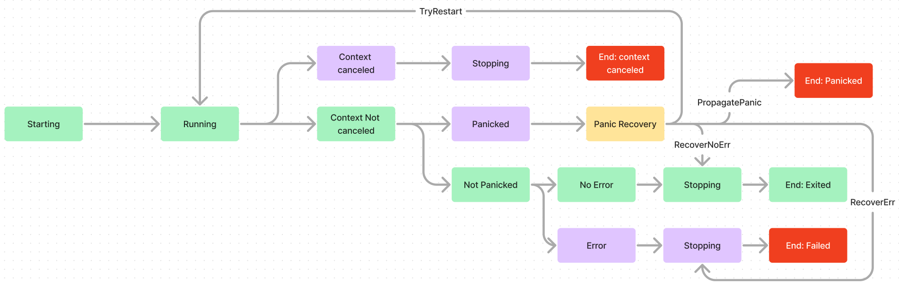

# 22 - Signal - Panic Recovery

- **Feature Name**: Panic recovery in Signal-managed goroutines
- **Status**: Draft
- **Start Date**: 2024-07-09
- **Authors**: Leo Liu

# 0 - Summary

In this RFC I outline a proposed design for providing options to the signal goroutine
manager to handle panics in its goroutines.

# 1 - Vocabulary and Abbreviations

**GR** - goroutine

# 2 - Motivation

The utilization of goroutines is crucial to Synnax. GRs are present in the lifetime of
almost all requests and responses to and from Synnax. When one of these GRs reach a
state where continuing execution is dangerous and results in data corruption, it panics
and ceases execution. By default, panicking in one GR propagates throughout the program
and eventually crashes the entire Synnax process.

However, not every GR's panic should crash the entire system: a non-mission critical
component of Synnax like Garbage Collection's panic should not cause the entire system
to shut down in production.

# 3 - Design

We provide the following panic recovery options:

- `RecoverErr`: Recover from the panic, but fail the goroutine as if an error had
  occurred.
- `RecoverNoErr`: Recover from the panic, but exit the goroutine as if no error had
  occurred
- `PropagatePanic`: Log relevant debug information for the panic, and propagate the
  panic to parent GR and eventually the rest of the system.
- `Restart`: Used along with the option `WithMaxRestart`, after a GR panics, try to
  restart the goroutine to execute the same function, up to `MaxRestart` times. If the
  GR still panics after `MaxRestart` restarts, the GR fails with the panic as an error.

    

