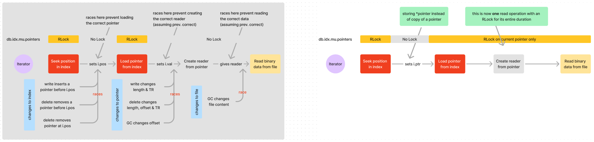

# 23 - Cesium Domain Index Data Structure change

- **Feature Name**: New supporting data structure in Cesium's internal indexing
- **Status**: Rev 1
- **Start Date**: 2024-07-10
- **Authors**: Leo Liu

## 0 - Summary

In this RFC I outline the motivation for changing Cesium's supporting data structure for
the domain index and propose possible designs.

## 1 - Vocabulary and Abbreviations

**Domain**: A domain is a time range with many samples stored contiguously in the same
file. In Cesium, **domains must not overlap each other**: the same moment in time cannot
have two different data points. These properties render the domain a powerful concept
because it allows us to make statements about an entire group of samples: if we know
that the time range 10:00 - 12:00 is stored in file 1 from offset 10 with length 10, and
we want to find the sample at 11:00, we know exactly where to look for it – this
prevents us from searching the entire database!

**Pointer**: A pointer is the implementation of a domain: a pointer is a `struct` that
stores the time range of the domain and where to find data for the domain in the file
system (file key, offset, length).

**Domain index**: The domain index is a chronologically-sorted slice of pointers stored
in memory. The pointers are sorted by their time range and no domain may overlap another
(as discussed in domain). The domain index allows us to find the domain that contains a
given time stamp (and does this fast via binary search) or the lack thereof.

## 2 - Motivation

As mentioned in the RFC analyzing Cesium race conditions, the domain iterator is prone
to race conditions. This is particularly because of its detachment to the domain index:
it knows its position in the domain index only on the basis of the position in the
slice. This is problematic if the array is modified concurrently shifting elements'
positions.

The three problems that require addressing are the following:

1. The iterator cannot track its current position since pointer positions in the domain
   index get concurrently shifted.
2. After the iterator loads its current pointer into memory, that pointer may be
   changed, leading to reading incorrect data.
3. After a reader is created, the underlying file may change due to garbage collection.

The array-based data structure is the culprit in the first problem: if we can track the
current position of the iterator via a pointer instead of a position, the problem of
shifting positions no longer occurs. For the second and third problem, better
synchronization is needed: ideally, the iterator has a read lock for the entire duration
of a read operation (even during syscalls). However, this was previously impossible as
with an array-based domain index, a lock must be acquired on the entire array, leading
to downtime for other operations while time-costly reads take place.

A pointer-based data structure that supports fine-grained concurrency control solves all
three of these problems.

## 3 - Design

### 3.1 - Choice of New Data Structure

The domain index is relatively well-abstracted and modularized: since we are only
changing the data structure implementation and not the interface, the scope of changes
should be very limited.

The domain index supporting data structure must:

1. allow insertion into a sorted data structure (by time range)
2. allow searching (by time range and their overlaps)
3. allow an iterator to move forward AND backward
4. allow ranged-deletion of many consecutive pointers (used in deletion)
5. be able to be persisted in a compact format & restored from persistence

In terms of complexity, we first consider the data structure's workload:

- Very heavy on insertion operations (**vast majority of them on the leading edge (hot
  path)**)
- Heavy on search operations
- Heavy on next/prev sequential access
- Infrequent updates, though **majority on leading edge** (append-commits) and very few
  in the middle (deletion and garbage collection)
- Infrequent range deletes

There are a variety of data structures that support fast sorted-insertion and updates.
They are generally either a tree-based structure, a linked-list based structure, or a
sorted-array based structure. The current supporting data structure is a sorted-array,
and we know its inability to store a fixed position in the domain index.

Tree-based structure (AVL / RB tree):

- Guarantees `O(log n)` complexity on insert, update, delete operations.
- `O(n)` range delete.
- On reads and writes, must lock entire tree to allow rotations.
- **`O(log n)` insertion to leading edge (which is our hot path)**.
- Cannot be locked in a fine-grained manner: tree rotations must use entire tree.

Linked-list-based structure (skip list):

- Probabilistically `O(log n)` insert, update, delete (worst case O(n)).
- `O(n)` range delete.
- **`O(1)` insertion to leading edge**.
- **Can be locked in a fine-grained manner**: every operation needs to only lock the
  operating node and its two neighbors, not the entire list.

Obviously, a skip list is a better choice than a tree-based structure. Nevertheless,
There are some concerns:

1. Ranged deletion becomes more tricky. They take `O(n)` time, and, more
   problematically, are harder to coordinate concurrently: locks on _all_ nodes must be
   acquired prior to an operation
2. The expected value for the number of nodes is `O(2n)` (pardon the unscientific use of
   big-O). This is twice the memory overhead we had in Cesium before.
3. A skip list is a probabilistic data structure that introduces a lot of complexity.
   However, I argue that a lot of this complexity is manageable via good abstraction and
   modularization.

### 3.2 - Difference in Domain Iterator Workflow

In the new workflow, there is no possibility of changing a pointer that is currently
being read from. This is done by ensuring that every time a read is served, instead of
relying on a replica of the pointer of interest in memory, the data needed to create an
underlying FS reader is retrieved directly from the domain index. In contrast with the
old workflow, this eliminates many race conditions.

    
    <h6>Old vs new iterator workflow </h6>

### 3.3 - Additional Remarks on the Skip List

- [Pebble](https://github.com/cockroachdb/pebble/blob/master/internal/arenaskl/skl.go)
  and [RocksDB](https://github.com/facebook/rocksdb/blob/master/memtable/skiplist.h)
  both use a skip list as their indexing structure.
- A skip list may be made completely lockless (Pebble does this) via atomic CAS
  operations by introducing some additional complexity. However, according to this
  [CMU final project paper](https://supertaunt.github.io/CMU_15618_project.github.io/15618_project_final.pdf),
  the effects don't seem dramatic.
- A skip list may also be
  [adapted](https://webdiis.unizar.es/asignaturas/APD/skip_list_cookbook.pdf) to enable
  `O(log n)` random-access.
