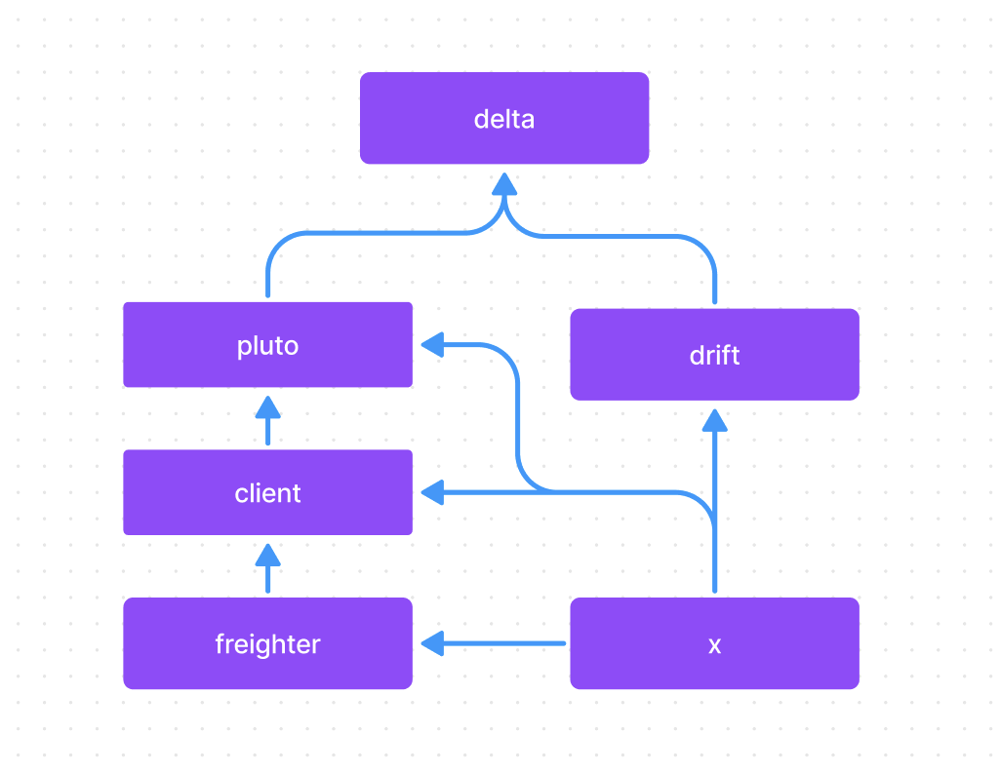

# The Synnax Front End Build System - pnpm and Turbo Repo

## How the Build System Works

Synnax is organized as a monorepo. Our front end software consists of five different
libraries:

- `@synnaxlabs/x` - path `x/ts` - Common utilities and types used by all other packages.
- `@synnaxlabs/media` - path `x/media` - Synnax specific media, including logos and
  icons - smallest library.
- `@synnaxlabs/freighter` - path `freighter/ts` - A transport adapter protocol for
  communicating with Synnax server.
- `@synnaxlabs/client` - path `client/ts` - The client library for communicating with a
  Synnax cluster.
- `@synnaxlabs/pluto` - path `pluto` - The Synnax component library.
- `@synnaxlabs/drift` - path `drift` - A cross window state synchronization library for
  [Tauri](https://tauri.studio/).

We have two main applications:

- `@synnaxlabs/console` - path `console` - The exploratory data analysis, cluster
  management, and control application.
- `@synnaxlabs/docs` - path `docs/site` - The Synnax documentation website.

There are also a few packages that are specifically for defining configurations for
various build/developments tools:

- `eslint-config-synnaxlabs` - path `configs/eslint` - The eslint configuration for
  Synnax typescript software.
- `@synnaxlabs/tsconfig` - path `configs/ts` - The typescript configuration for Synnax
  typescript software.
- `@synnaxlabs/vite-plugin` - path `configs/vite` - A custom plugin for building
  typescript applications using [vite](https://vitejs.dev/). We'll discuss vite in more
  detail later.

Each of these packages are developed, built, and published independently. The current
dependency hierarchy for these packages is as follows:

<p align="middle">
    
    <h6 align="Middle">Synnax Front End Dependency Graph</h6>
</p>

**Understanding/referencing this dependency graph is critical when developing Synnax
front end software.** We'll revisit this graph in a moment.

## pnpm

We use [pnpm](https://pnpm.js.org/) to manage all of our front end dependencies. This
includes both internal dependencies and those from external sources (e.g. npm).
Installing all dependencies is as simple as running

```bash
pnpm install
```

in the root directory of the repository. Unless you know what you're doing, avoid adding
new dependencies or upgrading dependency versions. These decisions should be made as a
team and handled with care.

As we'll see in a moment, we also use `pnpm` to run the commands that build packages,
run tests, and start development servers.

## Turbo Repo

If we refer back to the dependency graph above, we can see that `@synnaxlabs/console`
depends on `@synnaxlabs/pluto` and `@synnaxlabs/pluto` depends on `@synnaxlabs/x` and
`@synnaxlabs/client`. This has two implications:

1. If we make a change to `x` that we want reflected in `console`, we'd need to rebuild
   `x` and all of it's downstream dependencies (`pluto` and `console`).
2. We need to have built versions of all upstream dependencies before we can build the
   downstream dependency.

Luckily, we don't need to worry about which dependencies need to be built and in what
order. Instead, we use a tool called [turbo repo](https://turbo.fyi/). Turbo repo (or
just "turbo") is a tool designed to build monorepos. When we edit a file in an upstream
dependency, then build a downstream dependency, turbo will automatically detect that the
upstream dependency has changed and rebuild it before building the downstream
dependency. This is a huge time saver.

Turbo is configured in the [`turbo.json`](../../turbo.json) file in the root directory
of the repository.

## Building Packages

Building a package is as simple as running

```bash
pnpm build:PACKAGE_NAME
```

where `PACKAGE_NAME` is the name of the package you want to build. For example, to build
`@synnaxlabs/pluto`, we'd run

```bash
pnpm build:pluto
```

This will build `pluto` and all of its dependencies. If we want to build all packages,

Generally speaking, you'll be building `pluto` and `x` most often. We almost never build
`console` or `docs` locally, and instead rely on the CI/CD pipeline to build and publish
these applications for us.

## Important Caveats - Running Tests and Development Servers

While turbo is great for managing all of our build tooling, it's not designed for
running tests or development servers. In those situations, we need to make sure we
manually build dependencies whose changes we want reflected in our tests or development
servers.

The most common case here is when we're developing `pluto` and want to see our changes
reflected in `console`. To start the console dev server, we run:

```bash
pnpm dev:console
```

If we make a change to the `Input` component in `pluto`, we need to make sure we run

```bash
pnpm build:pluto
```

to see those changes reflected. The automatic reload on our dev servers should ensure
that there's no need to refresh the page.

The same principle applies to running tests. We need to make sure we build any upstream
dependencies whose changes we want reflected in our tests.

## Vite

There's one more very important, yet less seen and/or modified tool we use to build
Synnax front end software: [vite](https://vitejs.dev/). Vite is the underlying engine
that turbo uses to build our packages. You'll never need to run vite directly, but it's
important to know that it's there.

## Generating Libraries with Multiple Entrypoints

Make sure your `tsconfig.json` has 'composite' set to true. This is necessary for
building libraries with multiple entrypoints.
